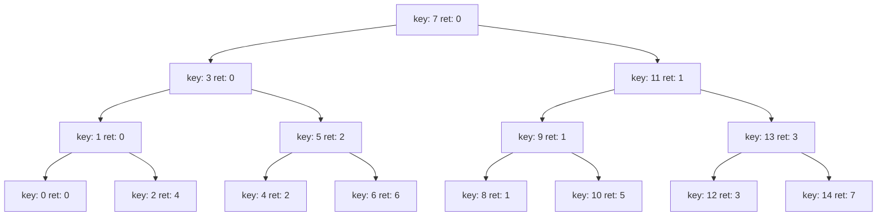
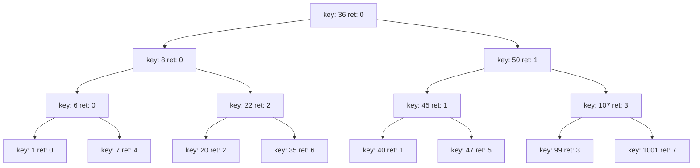

# BOMB LAB

很好玩的一个lab，跟解密游戏一样，层层递进，还有隐藏boss。

## Answer

> 存在多解，详见解析。

```txt
Border relations with Canada have never been better.
1 2 4 8 16 32
0 207
3 0 DrEvil
ionefg
4 3 2 1 6 5
20
```

## Solution

### Phase_1

```asm
0000000000400ee0 <phase_1>:
  400ee0:	48 83 ec 08          	sub    $0x8,%rsp

  400ee4:	be 00 24 40 00       	mov    $0x402400,%esi # 这里的地址就是模式串

  400ee9:	e8 4a 04 00 00       	call   401338 <strings_not_equal>
  400eee:	85 c0                	test   %eax,%eax
  400ef0:	74 05                	je     400ef7 <phase_1+0x17>
  400ef2:	e8 43 05 00 00       	call   40143a <explode_bomb>
  400ef7:	48 83 c4 08          	add    $0x8,%rsp
  400efb:	c3                 
```

这个很简单，显然只是与给定字符串比较是否相等（不放心的话可以去检查一下`<strings_not_equal>`，防止里面偷偷搞了什么加密运算）

```gdb
x/s 0x402400
```

然后得到答案了

### Phase_2

```asm
0000000000400efc <phase_2>:
  400efc:	55                   	push   %rbp
  400efd:	53                   	push   %rbx
  400efe:	48 83 ec 28          	sub    $0x28,%rsp
  400f02:	48 89 e6             	mov    %rsp,%rsi
  400f05:	e8 52 05 00 00       	call   40145c <read_six_numbers>
  400f0a:	83 3c 24 01          	cmpl   $0x1,(%rsp)                 # a1 = 1
  400f0e:	74 20                	je     400f30 <phase_2+0x34>
  400f10:	e8 25 05 00 00       	call   40143a <explode_bomb>
  400f15:	eb 19                	jmp    400f30 <phase_2+0x34>

  400f17:	8b 43 fc             	mov    -0x4(%rbx),%eax 
  400f1a:	01 c0                	add    %eax,%eax   # a(i-1) * 2
  400f1c:	39 03                	cmp    %eax,(%rbx)
  400f1e:	74 05                	je     400f25 <phase_2+0x29>      # ai == a(i-1) * 2
  400f20:	e8 15 05 00 00       	call   40143a <explode_bomb>

  400f25:	48 83 c3 04          	add    $0x4,%rbx
  400f29:	48 39 eb             	cmp    %rbp,%rbx
  400f2c:	75 e9                	jne    400f17 <phase_2+0x1b>
  400f2e:	eb 0c                	jmp    400f3c <phase_2+0x40>

  400f30:	48 8d 5c 24 04       	lea    0x4(%rsp),%rbx
  400f35:	48 8d 6c 24 18       	lea    0x18(%rsp),%rbp
  400f3a:	eb db                	jmp    400f17 <phase_2+0x1b>

  400f3c:	48 83 c4 28          	add    $0x28,%rsp
  400f40:	5b                   	pop    %rbx
  400f41:	5d                   	pop    %rbp
  400f42:	c3                   	ret
```

1. 首先确认输入为 `<read_six_numbers>`，确认无误后确定这题答案为 6 个 4 字节数字。
2. 找到循环，找到爆炸判定（`400f17` ~ `400f25`），`-0x4(%rbx)` 对应 `a[i-1]`，`(%rbx)`对应`a[i]`。
3. 答案为首项为 1 ，公比位 2 的等比数列

### Phase_3

```asm
0000000000400f43 <phase_3>:
  400f43:	48 83 ec 18          	sub    $0x18,%rsp
  400f47:	48 8d 4c 24 0c       	lea    0xc(%rsp),%rcx
  400f4c:	48 8d 54 24 08       	lea    0x8(%rsp),%rdx

  400f51:	be cf 25 40 00       	mov    $0x4025cf,%esi  "%d %d"

  400f56:	b8 00 00 00 00       	mov    $0x0,%eax
  400f5b:	e8 90 fc ff ff       	call   400bf0 <__isoc99_sscanf@plt>
  400f60:	83 f8 01             	cmp    $0x1,%eax
  400f63:	7f 05                	jg     400f6a <phase_3+0x27>
  400f65:	e8 d0 04 00 00       	call   40143a <explode_bomb>

  # <phase_3+0x27>
  400f6a:	83 7c 24 08 07       	cmpl   $0x7,0x8(%rsp)   # n1 <= 7
  400f6f:	77 3c                	ja     400fad <phase_3+0x6a>

  400f71:	8b 44 24 08          	mov    0x8(%rsp),%eax
  400f75:	ff 24 c5 70 24 40 00 	jmp    *0x402470(,%rax,8)

  # 0 
  400f7c:	b8 cf 00 00 00       	mov    $0xcf,%eax
  400f81:	eb 3b                	jmp    400fbe <phase_3+0x7b>
  # 2
  400f83:	b8 c3 02 00 00       	mov    $0x2c3,%eax
  400f88:	eb 34                	jmp    400fbe <phase_3+0x7b>
  # 3
  400f8a:	b8 00 01 00 00       	mov    $0x100,%eax
  400f8f:	eb 2d                	jmp    400fbe <phase_3+0x7b>
  # 4
  400f91:	b8 85 01 00 00       	mov    $0x185,%eax
  400f96:	eb 26                	jmp    400fbe <phase_3+0x7b>
  # 5
  400f98:	b8 ce 00 00 00       	mov    $0xce,%eax
  400f9d:	eb 1f                	jmp    400fbe <phase_3+0x7b>
  # 6
  400f9f:	b8 aa 02 00 00       	mov    $0x2aa,%eax
  400fa4:	eb 18                	jmp    400fbe <phase_3+0x7b>
  # 7
  400fa6:	b8 47 01 00 00       	mov    $0x147,%eax
  400fab:	eb 11                	jmp    400fbe <phase_3+0x7b>

  # <phase_3+0x6a>
  400fad:	e8 88 04 00 00       	call   40143a <explode_bomb>

  # can't reach here???
  400fb2:	b8 00 00 00 00       	mov    $0x0,%eax
  400fb7:	eb 05                	jmp    400fbe # ??hyw

  # 1
  400fb9:	b8 37 01 00 00       	mov    $0x137,%eax

  # <phase_3+0x7b>
  400fbe:	3b 44 24 0c          	cmp    0xc(%rsp),%eax # n2 == (n1 jmp to)
  400fc2:	74 05                	je     400fc9 <phase_3+0x86>
  400fc4:	e8 71 04 00 00       	call   40143a <explode_bomb>

  400fc9:	48 83 c4 18          	add    $0x18,%rsp
  400fcd:	c3                   	ret

```

1. 首先在`400f51`处，可以看出这里的地址是`sscanf`的输入，读出来这里的字符串是`"%d %d"`，得知这题输入是两个 4 字节整形。
2. 关键在于`400f75`处的间接跳转，可以想到这里的地址里存的应该是一个pc位置的数组，根据后面的比较，我们知道答案应该是 **第一个数对应偏移量**，**第二个数是对应跳转的分支上的值**

```gdb
(gdb) x/8gx 0x402470
0x402470:       0x0000000000400f7c      0x0000000000400fb9
0x402480:       0x0000000000400f83      0x0000000000400f8a
0x402490:       0x0000000000400f91      0x0000000000400f98
0x4024a0:       0x0000000000400f9f      0x0000000000400fa6
```

所有可行的答案：`0 207` `1 311` `2 707` `3 256` `4 392` `5 206` `6 682` `7 327`

### Phase_4

这里phase_4函数很好分析，就是输入两个数，在 0 ~ 14 范围内，需要第一个数经过`func4`运算后为 0，第二个数恒为 0。

>这里其实也可以不管 `func4`，就 15 个数，总有一个输出是 0，一个个试也能试出来。~~但这是，弱者的思维.jpg~~

```asm
0000000000400fce <func4>:
  400fce:	48 83 ec 08          	sub    $0x8,%rsp
  400fd2:	89 d0                	mov    %edx,%eax
  400fd4:	29 f0                	sub    %esi,%eax            // r - l
  400fd6:	89 c1                	mov    %eax,%ecx            // copy
  400fd8:	c1 e9 1f             	shr    $0x1f,%ecx           // get sign(0)
  400fdb:	01 c8                	add    %ecx,%eax            // r - l + sign
  400fdd:	d1 f8                	sar    $1,%eax              // (r - l + sign) / 2
  400fdf:	8d 0c 30             	lea    (%rax,%rsi,1),%ecx   // (l + r) / 2

  400fe2:	39 f9                	cmp    %edi,%ecx
  400fe4:	7e 0c                	jle    400ff2 <func4+0x24>

  // n1 < mid -> (l ~ mid - 1)
  400fe6:	8d 51 ff             	lea    -0x1(%rcx),%edx
  400fe9:	e8 e0 ff ff ff       	call   400fce <func4>
  400fee:	01 c0                	add    %eax,%eax
  400ff0:	eb 15                	jmp    401007 <func4+0x39>

  // <func4+0x24> mid <= n1
  400ff2:	b8 00 00 00 00       	mov    $0x0,%eax

  400ff7:	39 f9                	cmp    %edi,%ecx // mid == n1 -> ret 0
  400ff9:	7d 0c                	jge    401007 <func4+0x39>

  // (mid + 1 ~ r)
  400ffb:	8d 71 01             	lea    0x1(%rcx),%esi
  400ffe:	e8 cb ff ff ff       	call   400fce <func4>
  401003:	8d 44 00 01          	lea    0x1(%rax,%rax,1),%eax // ret * 2 + 1

  // <func4+0x39>
  401007:	48 83 c4 08          	add    $0x8,%rsp
  40100b:	c3                   	ret
```

其实这就是一个类似**二分查找**的递归，下面是可能的源码，功能一致。

```c
int func4(int x, int l, int r)
{
    int mid = l + (r - l) / 2;
    if (x < mid)       return 2 * func4(x, l, mid - 1);
    else if (x == mid) return 0;
    else               return 2 * func4(x, mid + 1, r) + 1;
}
```

抽象为下面的树形结构



显然第一个数只能取 0 1 3 7。

### Phase_5

```asm
0000000000401062 <phase_5>:
  401062:	53                   	push   %rbx
  401063:	48 83 ec 20          	sub    $0x20,%rsp
  401067:	48 89 fb             	mov    %rdi,%rbx
  40106a:	64 48 8b 04 25 28 00 	mov    %fs:0x28,%rax
  401071:	00 00 
  401073:	48 89 44 24 18       	mov    %rax,0x18(%rsp)
  401078:	31 c0                	xor    %eax,%eax
  40107a:	e8 9c 02 00 00       	call   40131b <string_length>
  40107f:	83 f8 06             	cmp    $0x6,%eax
  401082:	74 4e                	je     4010d2 <phase_5+0x70>
  401084:	e8 b1 03 00 00       	call   40143a <explode_bomb>
  401089:	eb 47                	jmp    4010d2 <phase_5+0x70>

  
  40108b:	0f b6 0c 03          	movzbl (%rbx,%rax,1),%ecx
  40108f:	88 0c 24             	mov    %cl,(%rsp)
  401092:	48 8b 14 24          	mov    (%rsp),%rdx

  401096:	83 e2 0f             	and    $0xf,%edx # 取低4位（0~15）作为偏移量

  401099:	0f b6 92 b0 24 40 00 	movzbl 0x4024b0(%rdx),%edx

  # (gdb) x/2s 0x4024b0
  # 0x4024b0 <array.3449>:  "maduiersnfotvbylSo you think you can stop the
  # bomb with ctrl-c, do you?"
  # 0x4024f8:       "Curses, you've found the secret phase!"

  # "m a d u i e r s n f o t v b y l"
  # "0 1 2 3 4 5 6 7 8 9 a b c d e f"
  # "flyers" <= "0x(6/4)" + "9 f e 5 6 7" <= "ionefg"

  4010a0:	88 54 04 10          	mov    %dl,0x10(%rsp,%rax,1) # new string


  4010a4:	48 83 c0 01          	add    $0x1,%rax
  4010a8:	48 83 f8 06          	cmp    $0x6,%rax
  4010ac:	75 dd                	jne    40108b <phase_5+0x29>

  4010ae:	c6 44 24 16 00       	movb   $0x0,0x16(%rsp)
  4010b3:	be 5e 24 40 00       	mov    $0x40245e,%esi     # "flyers"
  4010b8:	48 8d 7c 24 10       	lea    0x10(%rsp),%rdi
  4010bd:	e8 76 02 00 00       	call   401338 <strings_not_equal>
  4010c2:	85 c0                	test   %eax,%eax
  4010c4:	74 13                	je     4010d9 <phase_5+0x77>
  4010c6:	e8 6f 03 00 00       	call   40143a <explode_bomb>
  4010cb:	0f 1f 44 00 00       	nopl   0x0(%rax,%rax,1)
  4010d0:	eb 07                	jmp    4010d9 <phase_5+0x77>

  
  4010d2:	b8 00 00 00 00       	mov    $0x0,%eax  # eax 循环计数器
  4010d7:	eb b2                	jmp    40108b <phase_5+0x29>

  
  4010d9:	48 8b 44 24 18       	mov    0x18(%rsp),%rax
  4010de:	64 48 33 04 25 28 00 	xor    %fs:0x28,%rax
  4010e5:	00 00 
  4010e7:	74 05                	je     4010ee <phase_5+0x8c>
  4010e9:	e8 42 fa ff ff       	call   400b30 <__stack_chk_fail@plt>
  4010ee:	48 83 c4 20          	add    $0x20,%rsp
  4010f2:	5b                   	pop    %rbx
  4010f3:	c3                   	ret
```

看上面注释，这里就是对 `"flyers"` 的一个加密，`"maduiersnfotvbyl"`作为映射使用。

注意这里用掩码只截取了后四bit，也就是说这个答案是大小写不敏感的，非一一映射。


### Phase_6

```asm
00000000004010f4 <phase_6>:
  4010f4:	41 56                	push   %r14  // 0
  4010f6:	41 55                	push   %r13  // 0
  4010f8:	41 54                	push   %r12  // 2
  4010fa:	55                   	push   %rbp  // 0x7fffffffd780
  4010fb:	53                   	push   %rbx  // 0x7fffffffd808
  // 被调用者保存寄存器
  4010fc:	48 83 ec 50          	sub    $0x50,%rsp
  401100:	49 89 e5             	mov    %rsp,%r13
  401103:	48 89 e6             	mov    %rsp,%rsi
  401106:	e8 51 03 00 00       	call   40145c <read_six_numbers>
  40110b:	49 89 e6             	mov    %rsp,%r14
  40110e:	41 bc 00 00 00 00    	mov    $0x0,%r12d

  // Part1: O(n^2) 双层循环, 判断是否为1~6的排列
  // <phase_6+0x20>
  401114:	4c 89 ed             	mov    %r13,%rbp
  401117:	41 8b 45 00          	mov    0x0(%r13),%eax // a0
  40111b:	83 e8 01             	sub    $0x1,%eax // a0-1 // 细节 -1 排除 0
  40111e:	83 f8 05             	cmp    $0x5,%eax 
  401121:	76 05                	jbe    401128 <phase_6+0x34> //如果有0, -1后溢出,无符号比较下不成立
  401123:	e8 12 03 00 00       	call   40143a <explode_bomb>

  // a0 <= 5 
  401128:	41 83 c4 01          	add    $0x1,%r12d
  40112c:	41 83 fc 06          	cmp    $0x6,%r12d
  401130:	74 21                	je     401153 <phase_6+0x5f>
  401132:	44 89 e3             	mov    %r12d,%ebx

  // <phase_6+0x41>
  401135:	48 63 c3             	movslq %ebx,%rax
  401138:	8b 04 84             	mov    (%rsp,%rax,4),%eax
  40113b:	39 45 00             	cmp    %eax,0x0(%rbp)
  40113e:	75 05                	jne    401145 <phase_6+0x51>
  401140:	e8 f5 02 00 00       	call   40143a <explode_bomb>

  // <phase_6+0x51>
  401145:	83 c3 01             	add    $0x1,%ebx
  401148:	83 fb 05             	cmp    $0x5,%ebx
  40114b:	7e e8                	jle    401135 <phase_6+0x41>
  40114d:	49 83 c5 04          	add    $0x4,%r13
  401151:	eb c1                	jmp    401114 <phase_6+0x20>

  // Part2: 7 - a_n
  // <phase_6+0x5f>
  401153:	48 8d 74 24 18       	lea    0x18(%rsp),%rsi
  401158:	4c 89 f0             	mov    %r14,%rax
  40115b:	b9 07 00 00 00       	mov    $0x7,%ecx

  // <phase_6+0x6c>
  401160:	89 ca                	mov    %ecx,%edx
  401162:	2b 10                	sub    (%rax),%edx
  401164:	89 10                	mov    %edx,(%rax) // 7 - a_n
  401166:	48 83 c0 04          	add    $0x4,%rax 
  40116a:	48 39 f0             	cmp    %rsi,%rax
  40116d:	75 f1                	jne    401160 <phase_6+0x6c>
  


  // Part2: 用结构体(链表)按重构顺序排序
  40116f:	be 00 00 00 00       	mov    $0x0,%esi
  401174:	eb 21                	jmp    401197 <phase_6+0xa3>

  // <phase_6+0x82>
  401176:	48 8b 52 08          	mov    0x8(%rdx),%rdx  // p = p->nxt
  40117a:	83 c0 01             	add    $0x1,%eax
  40117d:	39 c8                	cmp    %ecx,%eax
  40117f:	75 f5                	jne    401176 <phase_6+0x82>
  401181:	eb 05                	jmp    401188 <phase_6+0x94>

  // <phase_6+0x8f>
  401183:	ba d0 32 60 00       	mov    $0x6032d0,%edx
  /*
  struct node
  {
    int value;
    int key;
    node *nxt;
  };
  */

  0x6032d0 <node1>:       332     1       nxt
  0x6032e0 <node2>:       168     2       nxt
  0x6032f0 <node3>:       924     3       nxt
  0x603300 <node4>:       691     4       nxt
  0x603310 <node5>:       477     5       nxt
  0x603320 <node6>:       443     6       nxt

  3 4 5 6 1 2
  4 3 2 1 6 5
  */

  // <phase_6+0x94>
  401188:	48 89 54 74 20       	mov    %rdx,0x20(%rsp,%rsi,2)
  40118d:	48 83 c6 04          	add    $0x4,%rsi
  401191:	48 83 fe 18          	cmp    $0x18,%rsi
  401195:	74 14                	je     4011ab <phase_6+0xb7>

  // <phase_6+0xa3>
  401197:	8b 0c 34             	mov    (%rsp,%rsi,1),%ecx
  40119a:	83 f9 01             	cmp    $0x1,%ecx
  40119d:	7e e4                	jle    401183 <phase_6+0x8f>

  40119f:	b8 01 00 00 00       	mov    $0x1,%eax
  4011a4:	ba d0 32 60 00       	mov    $0x6032d0,%edx
  4011a9:	eb cb                	jmp    401176 <phase_6+0x82>


  // Part3: 重构链表
  // <phase_6+0xb7>
  4011ab:	48 8b 5c 24 20       	mov    0x20(%rsp),%rbx // p->value
  4011b0:	48 8d 44 24 28       	lea    0x28(%rsp),%rax // q = p->next
  4011b5:	48 8d 74 24 50       	lea    0x50(%rsp),%rsi // end

  4011ba:	48 89 d9             	mov    %rbx,%rcx

  // <phase_6+0xc9>
  4011bd:	48 8b 10             	mov    (%rax),%rdx
  4011c0:	48 89 51 08          	mov    %rdx,0x8(%rcx)
  4011c4:	48 83 c0 08          	add    $0x8,%rax
  4011c8:	48 39 f0             	cmp    %rsi,%rax
  4011cb:	74 05                	je     4011d2 <phase_6+0xde>
  4011cd:	48 89 d1             	mov    %rdx,%rcx
  4011d0:	eb eb                	jmp    4011bd <phase_6+0xc9>


  // Part4: 降序检查
  // <phase_6+0xde>
  4011d2:	48 c7 42 08 00 00 00 	movq   $0x0,0x8(%rdx)
  4011d9:	00 
  4011da:	bd 05 00 00 00       	mov    $0x5,%ebp
  4011df:	48 8b 43 08          	mov    0x8(%rbx),%rax
  4011e3:	8b 00                	mov    (%rax),%eax
  4011e5:	39 03                	cmp    %eax,(%rbx)
  4011e7:	7d 05                	jge    4011ee <phase_6+0xfa>
  4011e9:	e8 4c 02 00 00       	call   40143a <explode_bomb>
  4011ee:	48 8b 5b 08          	mov    0x8(%rbx),%rbx
  4011f2:	83 ed 01             	sub    $0x1,%ebp
  4011f5:	75 e8                	jne    4011df <phase_6+0xeb>
  4011f7:	48 83 c4 50          	add    $0x50,%rsp
  4011fb:	5b                   	pop    %rbx
  4011fc:	5d                   	pop    %rbp
  4011fd:	41 5c                	pop    %r12
  4011ff:	41 5d                	pop    %r13
  401201:	41 5e                	pop    %r14
  401203:	c3                   	ret

```

上面的注释已经做了大致的功能分析。

这题的重点在于识别**链表**形式的结构体，以及链表的一些基础写法。

```c
struct node
{
  int value;
  int key;
  node *nxt;
};
```

### secret_phase

搜索一下文件中的 `<secret_phase>`，发现调用在`<phase_defused>`中，以及主角`<fun7>`。

```asm
0000000004015c4 <phase_defused>:
  4015c4:	48 83 ec 78          	sub    $0x78,%rsp
  4015c8:	64 48 8b 04 25 28 00 	mov    %fs:0x28,%rax
  4015cf:	00 00 
  4015d1:	48 89 44 24 68       	mov    %rax,0x68(%rsp)
  4015d6:	31 c0                	xor    %eax,%eax

  // 需先完成6个phase
  4015d8:	83 3d 81 21 20 00 06 	cmpl   $0x6,0x202181(%rip)        # 603760 <num_input_strings>
  4015df:	75 5e                	jne    40163f <phase_defused+0x7b>


  4015e1:	4c 8d 44 24 10       	lea    0x10(%rsp),%r8
  4015e6:	48 8d 4c 24 0c       	lea    0xc(%rsp),%rcx
  4015eb:	48 8d 54 24 08       	lea    0x8(%rsp),%rdx
  
  4015f0:	be 19 26 40 00       	mov    $0x402619,%esi                  // "%d %d %s"
  4015f5:	bf 70 38 60 00       	mov    $0x603870,%edi                  // "input of phase 4"
  4015fa:	e8 f1 f5 ff ff       	call   400bf0 <__isoc99_sscanf@plt>
  4015ff:	83 f8 03             	cmp    $0x3,%eax
  401602:	75 31                	jne    401635 <phase_defused+0x71>
  401604:	be 22 26 40 00       	mov    $0x402622,%esi                  // "DrEvil"
  401609:	48 8d 7c 24 10       	lea    0x10(%rsp),%rdi
  40160e:	e8 25 fd ff ff       	call   401338 <strings_not_equal>
  401613:	85 c0                	test   %eax,%eax
  401615:	75 1e                	jne    401635 <phase_defused+0x71> 
  401617:	bf f8 24 40 00       	mov    $0x4024f8,%edi                  // "Curses, you've found the secret phase!"
  40161c:	e8 ef f4 ff ff       	call   400b10 <puts@plt>
  401621:	bf 20 25 40 00       	mov    $0x402520,%edi                  // "But finding it and solving it are quite different..."
  401626:	e8 e5 f4 ff ff       	call   400b10 <puts@plt>
  40162b:	b8 00 00 00 00       	mov    $0x0,%eax

  401630:	e8 0d fc ff ff       	call   401242 <secret_phase>

  
  401635:	bf 58 25 40 00       	mov    $0x402558,%edi
  40163a:	e8 d1 f4 ff ff       	call   400b10 <puts@plt>

  // <phase_defused+0x7b>
  40163f:	48 8b 44 24 68       	mov    0x68(%rsp),%rax
  401644:	64 48 33 04 25 28 00 	xor    %fs:0x28,%rax
  40164b:	00 00 
  40164d:	74 05                	je     401654 <phase_defused+0x90>
  40164f:	e8 dc f4 ff ff       	call   400b30 <__stack_chk_fail@plt>
  401654:	48 83 c4 78          	add    $0x78,%rsp
  401658:	c3                   	ret
  401659:	90                   	nop
  40165a:	90                   	nop
  40165b:	90                   	nop
  40165c:	90                   	nop
  40165d:	90                   	nop
  40165e:	90                   	nop
  40165f:	90                   	nop
```

1. 注意到这里在 6 个phase解完后的`<phase_defuse>`会解析第四次输入是否为 `"%d %d %s"` ，也就是隐藏进入的方法为在第四次输入后面添加一个字符串。读取内存可以知道这个串是 `"DrEvil"` ~~邪恶Deltarune~~
2. `<secret_phase>` 读取一个数字字符串，并转化为 8 字节整型，之后经过`<fun7>` 运算结果为 2。以上为该题要求。


```asm
0000000000401204 <fun7>:
  401204:	48 83 ec 08          	sub    $0x8,%rsp
  401208:	48 85 ff             	test   %rdi,%rdi
  40120b:	74 2b                	je     401238 <fun7+0x34>
  
  40120d:	8b 17                	mov    (%rdi),%edx
  40120f:	39 f2                	cmp    %esi,%edx
  401211:	7e 0d                	jle    401220 <fun7+0x1c>

  // x < 36
  401213:	48 8b 7f 08          	mov    0x8(%rdi),%rdi
  401217:	e8 e8 ff ff ff       	call   401204 <fun7>
  40121c:	01 c0                	add    %eax,%eax
  40121e:	eb 1d                	jmp    40123d <fun7+0x39>

  // <fun7+0x1c> x >= 36
  401220:	b8 00 00 00 00       	mov    $0x0,%eax
  401225:	39 f2                	cmp    %esi,%edx
  401227:	74 14                	je     40123d <fun7+0x39>
  401229:	48 8b 7f 10          	mov    0x10(%rdi),%rdi
  40122d:	e8 d2 ff ff ff       	call   401204 <fun7>
  401232:	8d 44 00 01          	lea    0x1(%rax,%rax,1),%eax
  401236:	eb 05                	jmp    40123d <fun7+0x39>

  
  401238:	b8 ff ff ff ff       	mov    $0xffffffff,%eax

  // <fun7+0x39>
  40123d:	48 83 c4 08          	add    $0x8,%rsp
  401241:	c3                   	ret
```

3. `<fun7>`其实和`<func4>`很像。这里可以看出是一个类似二叉搜索树的树形结构，对应位置相同的节点返回值相同，但 key 值不同。与`<func4>`不同的地方在于，`<func4>`的树形结构、key、val都是由二分与递归天然形成的，而`<fun7>`的树形结构是由参数传入的，如下。


```asm
  40126e:	bf f0 30 60 00       	mov    $0x6030f0,%edi
  401273:	e8 8c ff ff ff       	call   401204 <fun7>
```

4. 接下来我们对这个地址储存的内容解析，这是一个很典型的**二叉树**。而且我们发现 key 大小的规律正好符合一颗**搜索二叉树**

```gdb
(gdb) x/64dg 0x6030f0
0x6030f0 <n1>:  36      6304016
0x603100 <n1+16>:       6304048 0
0x603110 <n21>: 8       6304144
0x603120 <n21+16>:      6304080 0
0x603130 <n22>: 50      6304112
0x603140 <n22+16>:      6304176 0
0x603150 <n32>: 22      6304368
0x603160 <n32+16>:      6304304 0
0x603170 <n33>: 45      6304208
0x603180 <n33+16>:      6304400 0
0x603190 <n31>: 6       6304240
0x6031a0 <n31+16>:      6304336 0
0x6031b0 <n34>: 107     6304272
0x6031c0 <n34+16>:      6304432 0
0x6031d0 <n45>: 40      0
0x6031e0 <n45+16>:      0       0
0x6031f0 <n41>: 1       0
0x603200 <n41+16>:      0       0
0x603210 <n47>: 99      0
0x603220 <n47+16>:      0       0
0x603230 <n44>: 35      0
0x603240 <n44+16>:      0       0
0x603250 <n42>: 7       0
0x603260 <n42+16>:      0       0
0x603270 <n43>: 20      0
0x603280 <n43+16>:      0       0
0x603290 <n46>: 47      0
0x6032a0 <n46+16>:      0       0
0x6032b0 <n48>: 1001    0
0x6032c0 <n48+16>:      0       0
```

结构体大概这样
```c
struct TreeNode
{
    long key;
    TreeNode *left_child;
    TreeNode *right_child;
};
```

对应的结构为



这次需要返回值为 2，对应的key值只有 20 22。

## 异常控制流彩蛋

按^C有惊喜，至于怎么捕获的等我学成归来在填充这部分内容。