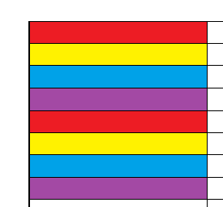

# CACHE LAB

需要对缓存的行为有较为深入的理解。

## Answer

### Part A - csim.c

```c
#include "cachelab.h"
#include <stdio.h>
#include <stdlib.h>
#include <bits/getopt_core.h>
#include <stdint.h>
#include <inttypes.h>
#include <stddef.h>
#include <unistd.h>

#define ADDR uint64_t

int hit, miss, eviction;

typedef struct LISTNODE
{
    uint64_t tag;
    struct LISTNODE* prev;
    struct LISTNODE* next;
} LISTNODE;

typedef struct LIST
{
    LISTNODE* head;
    LISTNODE* tail;
    int count;
} LIST;


LISTNODE* newNode(uint64_t data)
{
    LISTNODE* node = (LISTNODE*)malloc(sizeof(LISTNODE));
    node->tag = data;
    node->prev = node->next = NULL;
    return node;
}

void initList(LIST* list)
{
    list->head = (LISTNODE*)malloc(sizeof(LISTNODE));
    list->head->prev = list->head->next = NULL;
    list->tail = list->head;
    list->count = 0;
}

void headInsert(LIST* list, LISTNODE* node)
{
    list->count++;
    node->prev = list->head;
    node->next = list->head->next;
    if (list->head->next) list->head->next->prev = node;
    else list->tail = node;
    list->head->next = node;
}

void tailRemove(LIST* list)
{
    list->count--;
    LISTNODE* del = list->tail;
    list->tail = del->prev;
    list->tail->next = NULL;
    free(del);
}


void movetoHead(LIST* list, LISTNODE* node)
{
    if (node == list->head->next) return;
    
    node->prev->next = node->next;
    if (node->next) node->next->prev = node->prev;
    else list->tail = node->prev;
    node->next = list->head->next;
    node->prev = list->head;
    if (list->head->next) list->head->next->prev = node;
    else list->tail = node;
    list->head->next = node;
}


typedef struct CACHE
{
    int t;
    int s;
    int E;
    int b;
    size_t S;

    LIST** set;
} CACHE;

void printUsage(char *prog_name)
{
    printf("Usage: %s [-hv] -s <num> -E <num> -b <num> -t <file>\n", prog_name);
    printf("Options:\n");
    printf("  -h         Print this help message.\n");
    printf("  -v         Optional verbose flag.\n");
    printf("  -s <num>   Number of set index bits.\n");
    printf("  -E <num>   Number of lines per set.\n");
    printf("  -b <num>   Number of block offset bits.\n");
    printf("  -t <file>  Trace file.\n");
}

void printMiss(char *prog_name)
{
    fprintf(stderr, "%s:  Missing required command line argument\n", prog_name);
    printUsage(prog_name);
}

void printUndef(char *prog_name, char op)
{
    fprintf(stderr, "%s: invalid option -- '%c'\n", prog_name, op);
    printUsage(prog_name);
}

CACHE cache = { -1, -1, -1, -1 };
int verbose = 0;
char* file_name = NULL;

void getArgs(int argc, char* argv[])
{
    int opt = 0;
    while ((opt = getopt(argc, argv, ":hvs:E:b:t:")) != -1)
    {
        switch (opt)
        {
        case ':':
            printMiss(argv[0]);
            exit(0);
        case '?':
            printUndef(argv[0], optopt);
            exit(0);
        case 'h':
            printUsage(argv[0]);
            exit(0);
        case 'v':
            verbose = 1;
            break;
        case 's':
            cache.s = atoi(optarg);
            break;
        case 'E':
            cache.E = atoi(optarg);
            break;
        case 'b':
            cache.b = atoi(optarg);
            break;
        case 't':
            file_name = optarg;
            break;
        default:
            break;
        }
    }

    if (cache.s == -1 || cache.E == -1 || cache.b == -1 || file_name == NULL)
    {
        printMiss(argv[0]);
        exit(0);
    }
}

void initCache()
{
    cache.t = 64 - cache.b - cache.s;
    cache.S = 1LL << cache.s;
    cache.set = (LIST**)malloc(sizeof(LIST*) * cache.S);
    for (size_t i = 0; i < cache.S; i++)
    {
        cache.set[i] = (LIST*)malloc(sizeof(LIST));
        initList(cache.set[i]);
    }
}

void cacheManager(char c, ADDR addr, int bitsize)
{
    if (c == 'I') return;
    uint64_t target = addr >> (cache.b + cache.s);
    uint64_t sid = (addr >> cache.b) & ((1ULL << cache.s) - 1);
    LIST* setptr = cache.set[sid];
    LISTNODE* curptr = setptr->head->next;
    
    while (curptr)
    {
        if (target == curptr->tag) break;
        curptr = curptr->next;
    }

    if (!curptr)
    {
        LISTNODE* newn = newNode(target);
        headInsert(setptr, newn);
        miss++;
        if (verbose) printf(" miss");

        if (setptr->count > cache.E)
        {
            tailRemove(setptr);
            eviction++;
            if (verbose) printf(" eviction");
        }

        if (c == 'M')
        {
            hit++;
            if (verbose) printf(" hit");
        }
    }
    else
    {
        movetoHead(setptr, curptr);
        hit++;
        if (verbose) printf(" hit");
        if (c == 'M')
        {
            hit++;
            if (verbose) printf(" hit");
        }
    }
    
    if (verbose) printf("\n");
}

void calc()
{
    FILE* fp = fopen(file_name, "r");
    if (!fp) { perror("fopen"); exit(1); }

    char op;
    ADDR addr;
    size_t size;

    while (fscanf(fp, " %c %" SCNx64 ",%zu", &op, &addr, &size) == 3)
    {
        printf("%c %" PRIx64 ",%zu", op, addr, size);
        cacheManager(op, addr, size);
    }
    fclose(fp);
}

void freeAll()
{
    
}

int main(int argc, char* argv[])
{
    getArgs(argc, argv);
    initCache();
    calc();
    printSummary(hit, miss, eviction);
    freeAll();
    return 0;
}

```


### Part B - trans.c

这里仅给出两个重点要解释的函数，其中 `transpose_44` 并不算答案，因为这个函数违反了一点规则，局部变量超过了 12 个。

```c
/*
 * transpose_optimal - A size-aware version for the Cache Lab cache model.
 */
char transpose_optimal_desc[] = "Size-aware blocked transpose";
void transpose_optimal(int M, int N, int A[N][M], int B[M][N])
{
    int i, j, k, l, a0, a1, a2, a3, a4, a5, a6, a7;

    if (M == 32 && N == 32)
    {
        /* An 8-int cache block matches an 8x8 tile. Delay diagonal writes. */
        for (i = 0; i < N; i += 8)
        {
            for (j = 0; j < M; j += 8)
            {
                for (k = i; k < i + 8; k++)
                {
                    a1 = -1;
                    for (l = j; l < j + 8; l++)
                    {
                        a0 = A[k][l];
                        if (i == j && k == l)
                        {
                            a1 = k;
                            a2 = a0;
                        }
                        else
                        {
                            B[l][k] = a0;
                        }
                    }
                    if (a1 != -1)
                    {
                        B[a1][a1] = a2;
                    }
                }
            }
        }
    }
    else if (M == 64 && N == 64)
    {
        /* Split each 8x8 tile into 4x4 pieces to avoid direct-mapped conflicts. */
        for (i = 0; i < N; i += 8) {
            for (j = 0; j < M; j += 8) {
                for (k = i; k < i + 4; ++k) {
                    a0 = A[k][j];
                    a1 = A[k][j + 1];
                    a2 = A[k][j + 2];
                    a3 = A[k][j + 3];
                    a4 = A[k][j + 4];
                    a5 = A[k][j + 5];
                    a6 = A[k][j + 6];
                    a7 = A[k][j + 7];

                    B[j][k] = a0;
                    B[j + 1][k] = a1;
                    B[j + 2][k] = a2;
                    B[j + 3][k] = a3;
                    B[j][k + 4] = a4;
                    B[j + 1][k + 4] = a5;
                    B[j + 2][k + 4] = a6;
                    B[j + 3][k + 4] = a7;
                }

                for (l = j; l < j + 4; ++l) {
                    a0 = A[i + 4][l];
                    a1 = A[i + 5][l];
                    a2 = A[i + 6][l];
                    a3 = A[i + 7][l];
                    a4 = B[l][i + 4];
                    a5 = B[l][i + 5];
                    a6 = B[l][i + 6];
                    a7 = B[l][i + 7];

                    B[l][i + 4] = a0;
                    B[l][i + 5] = a1;
                    B[l][i + 6] = a2;
                    B[l][i + 7] = a3;
                    B[l + 4][i] = a4;
                    B[l + 4][i + 1] = a5;
                    B[l + 4][i + 2] = a6;
                    B[l + 4][i + 3] = a7;
                }

                for (k = i + 4; k < i + 8; ++k) {
                    a0 = A[k][j + 4];
                    a1 = A[k][j + 5];
                    a2 = A[k][j + 6];
                    a3 = A[k][j + 7];
                    B[j + 4][k] = a0;
                    B[j + 5][k] = a1;
                    B[j + 6][k] = a2;
                    B[j + 7][k] = a3;
                }
            }
        }
    }
    else
    {
        for (i = 0; i < N; i += 16)
        {
            for (j = 0; j < M; j += 16)
            {
                for (k = i; k < N && k < i + 16; k++)
                {
                    for (l = j; l < M && l < j + 16; l++)
                    {
                        B[l][k] = A[k][l];
                    }
                }
            }
        }
    }
}

/*
* for test only
*/
void transpose_44(int M, int N, int A[N][M], int B[M][N])
{
    int i, j, tmp[16];
    int N4 = N - 3, N2 = N - 1;
    int M4 = M - 3, M2 = M - 1;
    for (i = 0; i < N4; i += 4)
    {
        for (j = 0; j < M4; j += 4)
        {
            tmp[0] = A[i][j];
            tmp[1] = A[i][j + 1];
            tmp[2] = A[i][j + 2];
            tmp[3] = A[i][j + 3];
            tmp[4] = A[i + 1][j];
            tmp[5] = A[i + 1][j + 1];
            tmp[6] = A[i + 1][j + 2];
            tmp[7] = A[i + 1][j + 3];
            tmp[8] = A[i + 2][j];
            tmp[9] = A[i + 2][j + 1];
            tmp[10] = A[i + 2][j + 2];
            tmp[11] = A[i + 2][j + 3];
            tmp[12] = A[i + 3][j];
            tmp[13] = A[i + 3][j + 1];
            tmp[14] = A[i + 3][j + 2];
            tmp[15] = A[i + 3][j + 3];

            B[j][i] = tmp[0];
            B[j][i + 1] = tmp[4];
            B[j][i + 2] = tmp[8];
            B[j][i + 3] = tmp[12];
            B[j + 1][i] = tmp[1];
            B[j + 1][i + 1] = tmp[5];
            B[j + 1][i + 2] = tmp[9];
            B[j + 1][i + 3] = tmp[13];
            B[j + 2][i] = tmp[2];
            B[j + 2][i + 1] = tmp[6];
            B[j + 2][i + 2] = tmp[10];
            B[j + 2][i + 3] = tmp[14];
            B[j + 3][i] = tmp[3];
            B[j + 3][i + 1] = tmp[7];
            B[j + 3][i + 2] = tmp[11];
            B[j + 3][i + 3] = tmp[15];
        }

        if (j < M2)
        {
            tmp[0] = A[i][j];
            tmp[1] = A[i][j + 1];
            tmp[2] = A[i + 1][j];
            tmp[3] = A[i + 1][j + 1];
            tmp[4] = A[i + 2][j];
            tmp[5] = A[i + 2][j + 1];
            tmp[6] = A[i + 3][j];
            tmp[7] = A[i + 3][j + 1];

            B[j][i] = tmp[0];
            B[j][i + 1] = tmp[2];
            B[j][i + 2] = tmp[4];
            B[j][i + 3] = tmp[6];
            B[j + 1][i] = tmp[1];
            B[j + 1][i + 1] = tmp[3];
            B[j + 1][i + 2] = tmp[5];
            B[j + 1][i + 3] = tmp[7];

            j += 2;
        }

        if (j < M)
        {
            B[j][i] = A[i][j];
            B[j][i + 1] = A[i + 1][j];
            B[j][i + 2] = A[i + 2][j];
            B[j][i + 3] = A[i + 3][j];
        }
    }

    if (i < N2)
    {
        for (j = 0; j < M4; j += 4)
        {
            tmp[0] = A[i][j];
            tmp[1] = A[i][j + 1];
            tmp[2] = A[i][j + 2];
            tmp[3] = A[i][j + 3];
            tmp[4] = A[i + 1][j];
            tmp[5] = A[i + 1][j + 1];
            tmp[6] = A[i + 1][j + 2];
            tmp[7] = A[i + 1][j + 3];

            B[j][i] = tmp[0];
            B[j][i + 1] = tmp[4];
            B[j + 1][i] = tmp[1];
            B[j + 1][i + 1] = tmp[5];
            B[j + 2][i] = tmp[2];
            B[j + 2][i + 1] = tmp[6];
            B[j + 3][i] = tmp[3];
            B[j + 3][i + 1] = tmp[7];
        }

        if (j < M2)
        {
            tmp[0] = A[i][j];
            tmp[1] = A[i][j + 1];
            tmp[2] = A[i + 1][j];
            tmp[3] = A[i + 1][j + 1];

            B[j][i] = tmp[0];
            B[j][i + 1] = tmp[2];
            B[j + 1][i] = tmp[1];
            B[j + 1][i + 1] = tmp[3];

            j += 2;
        }

        if (j < M)
        {
            B[j][i] = A[i][j];
            B[j][i + 1] = A[i + 1][j];
        }
        
        i += 2;
    }

    if (i < N)
    {
        for (j = 0; j < M4; j += 4)
        {
            B[j][i] = A[i][j];
            B[j + 1][i] = A[i][j + 1];
            B[j + 2][i] = A[i][j + 2];
            B[j + 3][i] = A[i][j + 3];
        }

        if (j < M2)
        {
            B[j][i] = A[i][j];
            B[j + 1][i] = A[i][j + 1];

            j += 2;
        }

        if (j < M)
        {
            B[j][i] = A[i][j];
        }
    }
    
}

```

---

## Solution

### Part A

> 这个模拟的实现其实很粗糙，与实际的cache行为细节有巨大差异

#### 命令行解析

`getopt` 是 Linux/C 标准库中**专门用来解析命令行选项**（即 `-` 开头的参数）的工具函数。它的核心作用是：**自动帮你遍历 `argv`，识别哪些是选项、哪些是选项的值，并返回对应的选项字符，不用手写一堆 `strcmp` 去匹配字符串。**

---

**核心原理**

输入一个“格式规则”（**选项字符串**），它就会按这个规则去扫描 `argv`。

- 遇到 `-v`（无值选项），直接返回 `'v'`。
- 遇到 `-s 4`（有值选项），返回 `'s'`，并把 `"4"` 的地址放到全局变量 `optarg` 里。
- 遇到不认识或格式错误的，自动报错，返回 `'?'`。

---

**四个“全局变量”（由 `getopt` 自动维护）**

| 变量名 | 类型 | 作用 |
| :--- | :--- | :--- |
| **`optarg`** | `char *` | 当解析到**带参数**的选项时（如 `-s 4`），它指向这个参数值的字符串（即 `"4"`）。 |
| **`optind`** | `int` | 下一次调用时，从 `argv` 的哪个下标开始扫描。初始为 1（跳过程序名）。 |
| **`opterr`** | `int` | 设为 `0` 可以关闭系统自动报错（静默模式），默认非零（会打印错误）。 |
| **`optopt`** | `int` | 当遇到未知选项或缺少参数时，存放出错的选项字符，方便你手动报错。 |

---

**用法**

引入头文件` #include <unistd.h> `

这个字符串决定了 `getopt` 怎么识别参数：

- 单个字母（如 `h`、`v`）：代表**无值选项**（开关）。
- 字母后面跟一个冒号 `:`（如 `s:`、`E:`）：代表**必须有值**的选项。
- 字母后面跟两个冒号 `::`（GNU 扩展）：代表**可选值**（此处暂不涉及）。

在 `while` 循环中反复调用
`getopt` 会逐个解析 `argv`，直到解析完所有选项，返回 **`-1`** 退出循环。

在 `switch` 里处理返回值，并用 `optarg` 取值

---

#### 链表模拟与实际cache行为的区别

具体的模拟实现**LRU**反而没什么特别值得说道的地方

- tag的比对我们采用的较为暴力的**遍历链表**实现（复杂度 $ O(n) $），常见的教程中还有**HashMap**实现（复杂度 $ O(1) $）。
- 然而我们并不需要纠结这里的实现，因为在硬件中完全可以**并行比对**。
- 实际也并不存在什么链表，而是用**位矩阵（Bit Matrix）**来记录访问顺序

---

#### 其它细节

- 格式化字符串应该用 `SCNx64`（来自`<inttypes.h>`），这是专门为`uint64_t`设计的宏，输出时 `PRIx64`。


---

### Part B

> 1KB direct mapped cache with a block size of 32 bytes.
> 这说明每 block 可以容纳 8 个 int，
> 一共 32 个 block，E = 1

#### 朴素分块

`transpose_44` 虽然违规（因为自己没读清lab要求写的这个版本），且并不是最优，但具有一定的分析价值。

第一，不像最朴素转置那样：

```c
B[j][i] = A[i][j];
```

每读一个 A 就去跨行写一次 B，而是先把整个 4×4 的 A 读完，再集中写 B。

第二，写 B 的时候也是连续写：

```c
B[j][i]
B[j][i+1]
B[j][i+2]
B[j][i+3]
```

于是同一行 B 的 4 个元素能利用同一个 cache block。

这样既能够保证**连续性**，还能够避免A B之间的**抖动**

> **已经做了 blocking，但 block size 选成了固定 4×4，cache 的参数显示一块可以装 8个 int，8x8才是更适配的方案**

另外，**循环展开** 也对数据流进行了优化，由于 cache 的读写操作是 **fully-pipelined**，多个独立的读写操作可以更好地做到 **延迟隐藏**，但这个lab只看 cache miss，这个优化对最终结果无影响。

---

#### 和 `transpose_optimal` 的总体 miss 差距


| 矩阵    |        4×4 |      optimal |     差距 |
| ----- | -----------: | -----------: | -----: |
| 32×32 |  ~400 misses |  ~284 misses | 少约 116 |
| 64×64 | ~1600 misses | ~1176 misses | 少约 424 |
| 61×67 | ~2170 misses | ~1990 misses | 少约 180 |

对应大概的 cache hit rate：

| 矩阵    | 4x4 hit rate | optimal hit rate |
| ----- | ----------: | ---------------: |
| 32×32 |      ~80.5% |           ~86.1% |
| 64×64 |      ~80.5% |           ~88.5% |
| 61×67 |      ~73.5% |           ~75.7% |

不过 **64×64 的 hit rate 不能直接横向按百分比看**，因为 optimal 为了降低真正昂贵的 miss，故意对 B 做了一些额外的“临时读写”，总访存次数更多。真正评分看的是 **miss 数**，而它能从大约 1600 压到 1200 左右，这才是关键。


#### 满分解答`transpose_optimal`


##### 一、为什么 32×32 要用 8×8

`transpose_optimal` 对 32×32 使用：

```c
for (i = 0; i < N; i += 8)
    for (j = 0; j < M; j += 8)
```

> **8×8 blocking 和 32B cache block 是天然匹配的。**

4×4 为什么会浪费这个 cache block

每次只读：

```c
A[i][j]
A[i][j+1]
A[i][j+2]
A[i][j+3]
```

但一次 cache miss 实际上已经把：

```text
A[i][j ... j+7]
```

共 8 个 int 全读进来了。

也就是说你实际使用了前 4 个 int

然后就开始处理 B。

之后下一个 tile 才访问：

```text
A[i][j+4 ... j+7]
```

理论上它们本来还在同一个 cache block 中。

但中间已经进行了大量 B 的写入。

在 direct-mapped cache 中，这些 B 的 block 很可能把刚才 A 的 block 挤掉。

本来一个 cache block 可以“一次 miss，吃完 8 个 int”，却把它拆成两次 4-int 使用。

这就是 4×4 相比 8×8 的第一个明显损失。

---

##### 二、32×32 中 `transpose_optimal` 为什么特别延迟对角线写入

这里是 32×32 优化里非常精髓的一点。

```c
a0 = A[k][l];

if (i == j && k == l)
{
    a1 = k;
    a2 = a0;
}
else
{
    B[l][k] = a0;
}
```

等这一整行处理完后才：

```c
B[a1][a1] = a2;
```

前面分析4x4时提到 **direct-mapped cache 的 A/B 冲突问题**。

`A[k][k]`和`B[k][k]` 它们在 A 和 B 中处于“对应位置”。

由于 A 和 B 的数组布局、矩阵大小和 cache set 数都是规则的，它们很容易映射到**同一个 set**。

于是可能发生：

```text
1. 访问 A[k][k]
   -> A 当前这一整块进入 cache

2. 马上写 B[k][k]
   -> B[k][k] 映射到同一个 set
   -> A 的 block 被驱逐

3. 接着访问 A[k][k+1]
   -> 明明属于刚才那个 A block
   -> 但已经被 B[k][k] 踢出去了
   -> 再 miss
```

所以一次本应：

```text
miss + 7 hits
```

的访问，可能被打断成：

```text
miss
...
B 写入把 A 踢掉
miss
...
```

所以 optimal 先把 `A[k][k]` 放寄存器，而不是立即写 B。

```text
A[k][j ... j+7]
```

这一整行都访问完成之后，A 当前 block 已经没有用了，再执行：

```c
B[k][k] = saved;
```

这时候就算 B 把 A 踢出去也无所谓。

这是一种非常典型的思想：

> **不是阻止 eviction，而是把 eviction 推迟到“被驱逐的数据已经没用了”的时刻。**

---

##### 三、64×64存在块内set冲突

这是你和 optimal 差距最大的部分。

64×64 一行有 8 cache blocks

因此从 `A[i][j]` 到 `A[i+1][j]`，set 号变化：+8 mod 32

于是同一个列块里：

```text
row i      -> set x
row i+1    -> set x+8
row i+2    -> set x+16
row i+3    -> set x+24
row i+4    -> set x+32 ≡ x
```


```text
row i
row i+4
```

**映射到了相同的 cache set**


所以 64×64 存在一个极其重要的周期：

```text
第 0 行和第 4 行冲突
第 1 行和第 5 行冲突
第 2 行和第 6 行冲突
第 3 行和第 7 行冲突
```

一个 **8x8块** 直观感受如下图，同颜色块代表映射到同一个 set。



---

##### 四、 64×64 分块 8x8，块内再分 4x4 

这是整个 Cache Lab 最值得搞懂的一段。

它还是从 **8×8 大块**出发：

```c
for (i = 0; i < N; i += 8)
    for (j = 0; j < M; j += 8)
```

但内部把 8×8 拆成四个 4×4：

```text
A tile:

┌─────────┬─────────┐
│   A00   │   A01   │
│   4×4   │   4×4   │
├─────────┼─────────┤
│   A10   │   A11   │
│   4×4   │   4×4   │
└─────────┴─────────┘
```

转置后 B 应该是：

```text
B tile:

┌─────────┬─────────┐
│ A00^T   │ A10^T   │
├─────────┼─────────┤
│ A01^T   │ A11^T   │
└─────────┴─────────┘
```

optimal 做的事情本质上就是：

> **一次吃完整的 8-int A cache line，但不要同时把相互冲突的上下 4 行放进 cache。**

```c
for (k = i; k < i + 4; ++k) {
    a0 = A[k][j];
    a1 = A[k][j + 1];
    ...
    a7 = A[k][j + 7];
}
```
但 A01 的数据现在**不能直接放最终位置**

读取这一行后：

```text
a0 a1 a2 a3 | a4 a5 a6 a7
```

前四个来自 `A00` 后四个来自 `A01`

`A00` 可以直接写到最终位置：

```c
B[j][k]     = a0;
B[j + 1][k] = a1;
B[j + 2][k] = a2;
B[j + 3][k] = a3;
```

但后四个没有立即写到目标位置，而是暂时写：

```c
B[j][k + 4]     = a4;
B[j + 1][k + 4] = a5;
B[j + 2][k + 4] = a6;
B[j + 3][k + 4] = a7;
```

也就是 B 的右上角被暂时借来当 scratch space。

因为这个 Lab 不允许数组，局部变量数有限。

> **所以它利用 B 本身作为一个临时缓冲区。**


目标是，让数据在 cache block 被赶走之前，把能做的事情全部做完。

---

之后，交换右上和左下两个 4×4 quadrant

```c
for (l = j; l < j + 4; ++l) {
    a0 = A[i + 4][l];
    a1 = A[i + 5][l];
    a2 = A[i + 6][l];
    a3 = A[i + 7][l];

    a4 = B[l][i + 4];
    a5 = B[l][i + 5];
    a6 = B[l][i + 6];
    a7 = B[l][i + 7];

    B[l][i + 4] = a0;
    ...
    B[l + 4][i] = a4;
    ...
}
```


逻辑上做的是：

```text
先从 A10 取一列数据

同时从 B 临时区取回之前暂存的 A01

然后：

A10 -> 放到 B 的右上正确位置
A01 -> 搬到 B 的左下正确位置
```

也就是把：

```text
临时状态：

┌────────┬────────┐
│ A00^T  │ A01 临时│
├────────┼────────┤
│   ?    │   ?    │
└────────┴────────┘
```

变成：

```text
┌────────┬────────┐
│ A00^T  │ A10^T  │
├────────┼────────┤
│ A01^T  │   ?    │
└────────┴────────┘
```

这里真正的优化意义是：

> 上半块 A 已经全部用完，因此即使下面四行 A 会映射到同样的 set，把上面四行 A 驱逐出去，也已经无所谓。

又一次体现了同一个思想：**让 evictions 发生在“旧数据已经没用”的时候。**

---

最后处理 `A11`

```c
for (k = i + 4; k < i + 8; ++k) {
    a0 = A[k][j + 4];
    ...
    a3 = A[k][j + 7];

    B[j + 4][k] = a0;
    ...
}
```

此时 `A00` `A01` `A10` 已经不需要了。

所以可以安心使用那些相同的 cache sets。

---

##### 五、61×67 为什么反而不用复杂的 64×64 技巧

`transpose_optimal` 对其他尺寸直接使用：

```c
for (i = 0; i < N; i += 16)
    for (j = 0; j < M; j += 16)
```

即 16×16 blocking。

这是因为 61×67 不像 64×64 那么“整齐”。刚才的块内冲突不会稳定触发，实际少量的**抖动**影响不大。

---

#### Lab 规则为什么限制局部变量

Lab 明确要求：**不允许定义数组**，**最多 12 个 int 局部变量**

Part B 里会把栈访问从 **Valgrind trace** 中过滤掉。如果允许你定义局部数组，那么你就可以把大量矩阵数据先搬到栈上的数组里，而这些访问在最终评分时“不计 cache 成本”，这会人为绕过实验真正想考察的 A/B 数组访问模式。文档明确说明，测试程序过滤了 stack accesses，也正因为如此才禁止 local arrays，并限制局部变量数量。

12 个 int 的设计是非常刻意的：

8 个数据寄存器 + 4 个循环变量，刚好顶满 12 个 int 限制

所以它不仅是在做 cache 优化，还同时是在规则允许范围内尽可能多地利用寄存器。