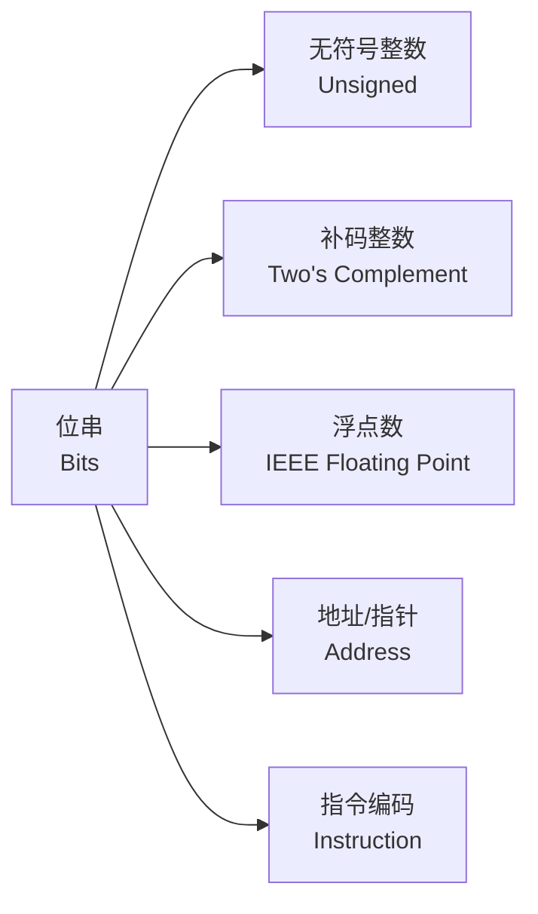
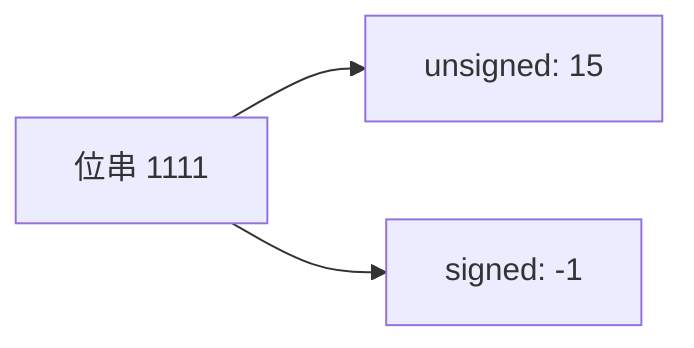
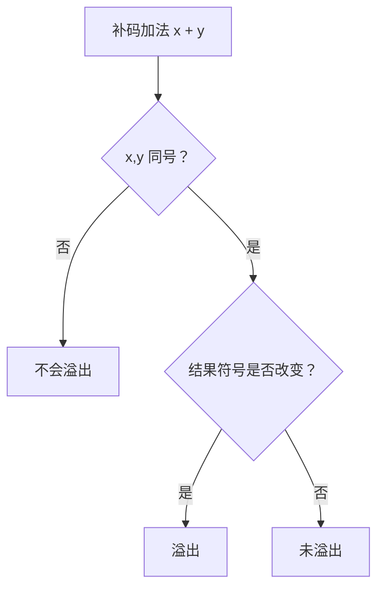
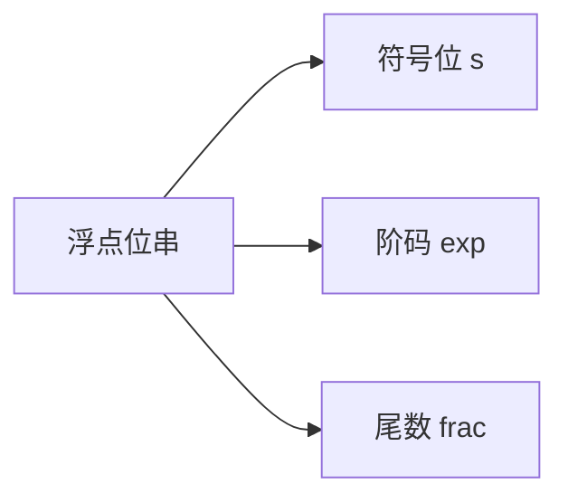
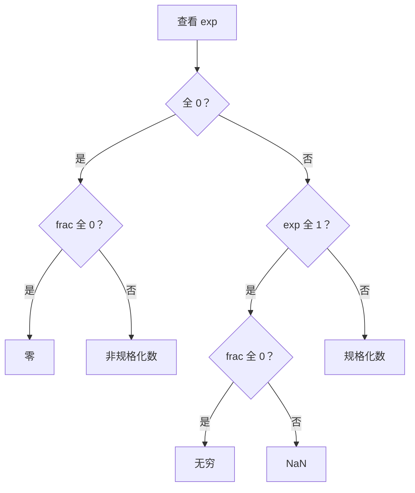

# 第 2 章：信息的表示和处理

> 主题：信息的表示和处理 (Representing and Manipulating Information)  
> 目标：理解计算机如何用位表示整数、浮点数和地址，并掌握溢出、转换、舍入等底层规则。

## 1. 核心视角

所有数据在机器中本质都是位串。



同一段位串，解释方式不同，含义就不同。

| 位串 | 解释方式 | 结果 |
|---|---:|---:|
| `11111111` | 无符号 8 位整数 | `255` |
| `11111111` | 补码 8 位整数 | `-1` |
| `0x41` | 字符 | `'A'` |

## 2. 信息存储基础

| 概念 | 含义 |
|---|---|
| 位 (Bit) | 最小信息单位，取值 `0` 或 `1` |
| 字节 (Byte) | 8 位 |
| 字长 (Word Size) | 指针数据的标称大小，常见为 64 位 |
| 地址 (Address) | 内存中字节的位置编号 |
| 虚拟地址空间 (Virtual Address Space) | 程序看到的地址范围 |

常见大小：

| C 类型 | 常见 x86-64 大小 |
|---|---:|
| `char` | 1 字节 |
| `short` | 2 字节 |
| `int` | 4 字节 |
| `long` | 8 字节 |
| `char *` | 8 字节 |
| `float` | 4 字节 |
| `double` | 8 字节 |

> C 标准只规定最小范围，不保证所有平台大小完全一致。CSAPP 第 2 章默认主要讨论 x86-64 环境。

## 3. 十六进制

4 个二进制位对应 1 个十六进制位。

| 二进制 | 十六进制 | 十进制 |
|---|---:|---:|
| `0000` | `0x0` | 0 |
| `0001` | `0x1` | 1 |
| `0010` | `0x2` | 2 |
| `0011` | `0x3` | 3 |
| `0100` | `0x4` | 4 |
| `0101` | `0x5` | 5 |
| `0110` | `0x6` | 6 |
| `0111` | `0x7` | 7 |
| `1000` | `0x8` | 8 |
| `1001` | `0x9` | 9 |
| `1010` | `0xA` | 10 |
| `1011` | `0xB` | 11 |
| `1100` | `0xC` | 12 |
| `1101` | `0xD` | 13 |
| `1110` | `0xE` | 14 |
| `1111` | `0xF` | 15 |

## 4. 字节序

多字节对象在内存中的字节排列方式称为字节序 (Byte Ordering)。

假设整数：

```text
0x01234567
```

| 地址从低到高 | 字节序 | 内存排列 |
|---|---|---|
| 小端法 (Little Endian) | 低有效字节在前 | `67 45 23 01` |
| 大端法 (Big Endian) | 高有效字节在前 | `01 23 45 67` |


> x86-64 使用小端法。调试内存时看到字节顺序反过来，通常就是小端造成的。

## 5. 位级运算

常用技巧：

| 目标 | 表达式 |
|---|---|
| 掩码最低 8 位 | `x & 0xFF` |
| 设置最低 8 位为 1 | `x \| 0xFF` |
| 清零最低 8 位 | `x & ~0xFF` |
| 判断某些位是否全 0 | `(x & mask) == 0` |
| 交换两个值，不推荐实战使用 | `x ^= y; y ^= x; x ^= y;` |

逻辑运算和位级运算不同：

| 运算 | 示例 | 结果特征 |
|---|---|---|
| 逻辑与 | `x && y` | 结果只为 `0` 或 `1`，有短路 |
| 逻辑或 | `x \|\| y` | 结果只为 `0` 或 `1`，有短路 |
| 逻辑非 | `!x` | `x == 0` 时为 `1` |
| 按位与 | `x & y` | 逐位计算，无短路 |

## 6. 移位

| 操作 | 表达式 | 规则 |
|---|---|---|
| 左移 | `x << k` | 右侧补 0 |
| 逻辑右移 | `x >> k` | 左侧补 0 |
| 算术右移 | `x >> k` | 左侧补符号位 |

右移差异：

```text
x = 10000000

逻辑右移 1 位：01000000
算术右移 1 位：11000000
```

> 对无符号数，右移是逻辑右移。  
> 对有符号负数，C 标准未完全保证，但多数机器使用算术右移。

## 7. 无符号整数

w 位无符号整数的取值范围：

```text
0 <= x <= 2^w - 1
```

位向量：

```text
x = [x_{w-1}, ..., x_1, x_0]
```

解释为：

```text
B2U_w(x) = sum(x_i * 2^i), i = 0..w-1
```

示例：

| 位串 | 无符号值 |
|---|---:|
| `0000` | 0 |
| `0001` | 1 |
| `0111` | 7 |
| `1000` | 8 |
| `1111` | 15 |

## 8. 补码整数

w 位补码整数的取值范围：

```text
-2^(w-1) <= x <= 2^(w-1) - 1
```

位向量解释为：

```text
B2T_w(x) = -x_{w-1} * 2^(w-1) + sum(x_i * 2^i), i = 0..w-2
```

4 位补码示例：

| 位串 | 补码值 |
|---|---:|
| `0000` | 0 |
| `0001` | 1 |
| `0111` | 7 |
| `1000` | -8 |
| `1001` | -7 |
| `1111` | -1 |

关键点：

| 名称 | 4 位示例 | w 位一般形式 |
|---|---:|---:|
| 最小值 `TMin` | `1000` = -8 | `-2^(w-1)` |
| 最大值 `TMax` | `0111` = 7 | `2^(w-1)-1` |
| `-1` | `1111` | 全 1 |
| `0` | `0000` | 全 0 |

> **非对称性**：补码最小值没有对应的正数。  
> 例如 4 位中 `-8` 存在，但 `+8` 不存在。

## 9. 有符号与无符号转换

C 中有符号数和无符号数转换时，**底层位不变，解释方式改变**。



转换规则：

| 转换 | 规则 |
|---|---|
| `int -> unsigned` | 若负数 `x`，结果为 `x + 2^w` |
| `unsigned -> int` | 若值大于 `TMax`，结果为 `u - 2^w` |
| 比较中混用 | 有符号数通常会转为无符号数 |

典型坑：

```c
int x = -1;
unsigned y = 0;
printf("%d\n", x < y);   // 通常输出 0
```

原因：`x` 被转换为无符号数，`-1` 变为 `UINT_MAX`。

## 10. 扩展与截断

### 10.1 扩展

| 类型 | 方法 | 示例 |
|---|---|---|
| 无符号扩展 | 高位补 0 | `1011 -> 00001011` |
| 补码扩展 | 高位补符号位 | `1011 -> 11111011` |

补码符号扩展保持数值不变。

```text
4 位：1011 = -5
8 位：11111011 = -5
```

### 10.2 截断

截断就是丢弃高位。

```text
0x12345678 截断为 16 位：0x5678
```

数学上等价于：

```text
x mod 2^k
```

> 截断后如果再按补码解释，符号和值都可能改变。

## 11. 整数加法与溢出

机器整数运算通常是模运算。

```text
w 位无符号加法：
(x + y) mod 2^w
```

无符号加法溢出：

| 条件 | 判断 |
|---|---|
| `s = x + y` 溢出 | `s < x` 或 `s < y` |

补码加法溢出：

| 情况 | 溢出判断 |
|---|---|
| 正数 + 正数 得到负数 | 正溢出 |
| 负数 + 负数 得到非负数 | 负溢出 |
| 一正一负 | 不会溢出 |



## 12. 取反与乘法

补码取负：

```text
-x = ~x + 1
```

特殊情况：

```text
-TMin == TMin
```

原因：`TMin` 没有可表示的正数对应值。

乘法：

```text
w 位整数乘法只保留低 w 位
```

对于乘以 2 的幂：

| 表达式 | 可优化为 |
|---|---|
| `x * 2^k` | `x << k` |
| `x / 2^k`，非负数 | `x >> k` |
| `x / 2^k`，有符号数 | 需要考虑向 0 舍入 |

有符号除以 2 的幂时，编译器常加偏置：

```text
(x + (1 << k) - 1) >> k    // x < 0 时用于向 0 舍入
```

## 13. 整数安全问题

| 问题 | 例子 | 风险 |
|---|---|---|
| 无符号下溢 | `0u - 1` | 得到很大的数 |
| 有符号溢出 | `INT_MAX + 1` | C 中属于未定义行为 |
| 混合比较 | `-1 < 0u` | 结果可能反直觉 |
| 长度计算溢出 | `n * sizeof(T)` | 分配空间不足 |
| 反向循环 | `for (size_t i=n-1; i>=0; i--)` | 死循环 |

更稳妥的写法：

```c
for (size_t i = n; i > 0; i--) {
    size_t idx = i - 1;
    /* use idx */
}
```

## 14. 浮点数表示

IEEE 浮点数 (IEEE Floating Point) 由三部分组成：



通用形式：

```text
V = (-1)^s * M * 2^E
```

常见格式：

| 类型 | 总位数 | 符号位 | 阶码位 | 尾数位 | Bias |
|---|---:|---:|---:|---:|---:|
| `float` | 32 | 1 | 8 | 23 | 127 |
| `double` | 64 | 1 | 11 | 52 | 1023 |

## 15. 浮点数三类编码

| 阶码 exp | 尾数 frac | 类型 | 数值 |
|---|---|---|---|
| `00...0` | `00...0` | 零 | `+0` 或 `-0` |
| `00...0` | 非 0 | 非规格化数 (Denormalized) | `(-1)^s * 0.frac * 2^(1-Bias)` |
| 非全 0/非全 1 | 任意 | 规格化数 (Normalized) | `(-1)^s * 1.frac * 2^(exp-Bias)` |
| `11...1` | `00...0` | 无穷 | `+∞` 或 `-∞` |
| `11...1` | 非 0 | NaN | 非数值 |



## 16. 浮点舍入

常见舍入模式：

| 模式 | 含义 |
|---|---|
| 向偶数舍入 (Round to Even) | 默认模式，减少统计偏差 |
| 向零舍入 | 截断小数部分 |
| 向下舍入 | 向 `-∞` |
| 向上舍入 | 向 `+∞` |

向偶数舍入：

| 值 | 保留到整数 | 结果 |
|---|---:|---:|
| `1.4` | 整数 | 1 |
| `1.5` | 整数 | 2 |
| `2.5` | 整数 | 2 |
| `3.5` | 整数 | 4 |

> 正好在中间时，选择最低有效位为偶数的结果。

## 17. 浮点运算性质

浮点运算近似实数运算，但不满足所有数学性质。

| 性质 | 整数/实数 | 浮点数 |
|---|---|---|
| 加法交换律 | 成立 | 通常成立 |
| 加法结合律 | 成立 | 不一定成立 |
| 乘法结合律 | 成立 | 不一定成立 |
| 分配律 | 成立 | 不一定成立 |
| 溢出 | 数学整数无溢出 | 可能得到 `∞` |
| 非法值 | 无 | 可能得到 `NaN` |

示例：

```c
(3.14 + 1e20) - 1e20   // 可能得到 0
3.14 + (1e20 - 1e20)   // 得到 3.14
```

## 18. C 中的强制转换

| 转换 | 规则/风险 |
|---|---|
| `int -> float` | 可能舍入，但不会溢出 |
| `int -> double` | 通常能精确表示 32 位 int |
| `long -> double` | 可能舍入 |
| `float/double -> int` | 向零舍入，超范围或 NaN 行为需谨慎 |
| `float -> double` | 精度扩展 |
| `double -> float` | 可能舍入或溢出 |

精度关系：

| 类型 | 有效精度 |
|---|---:|
| `float` | 约 24 个二进制有效位 |
| `double` | 约 53 个二进制有效位 |
| `int` | 通常 32 位 |
| `long` | x86-64 通常 64 位 |

因此：

```text
int -> double 通常精确
int -> float 可能不精确
long -> double 可能不精确
```

## 19. Data Lab 关联

`labs/data-lab` 主要训练本章内容。

| 主题 | Data Lab 中常见能力 |
|---|---|
| 位级运算 | 只用 `~ & ^ \| + << >>` 构造表达式 |
| 补码 | 判断符号、取负、边界值 |
| 溢出 | 实现比较、加法安全判断 |
| 掩码 | 构造全 0、全 1、局部位段 |
| 逻辑运算 | 用位运算模拟 `!`、条件选择 |
| 浮点数 | 拆分 sign/exp/frac，处理 NaN/∞/非规格化数 |

## 20. 常见坑

| 坑 | 正确理解 |
|---|---|
| 认为位串有固定含义 | 位串含义取决于解释方式 |
| 忘记小端字节序 | x86-64 内存中低有效字节在低地址 |
| 把逻辑运算和位运算混用 | `&&`/`\|\|` 有短路，`&`/`\|` 是逐位运算 |
| 以为有符号溢出会稳定回绕 | C 中有符号溢出是未定义行为 |
| 混用 signed/unsigned | signed 通常会转 unsigned |
| 忘记截断会改变符号 | 高位丢失后再解释可能变负数 |
| 以为浮点数就是实数 | 浮点数有限、离散、会舍入 |
| 期待浮点加法结合律 | 舍入会破坏结合律 |
