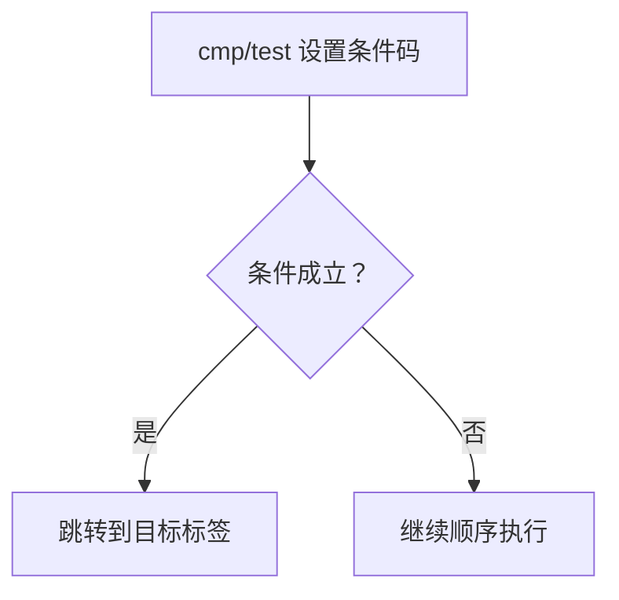
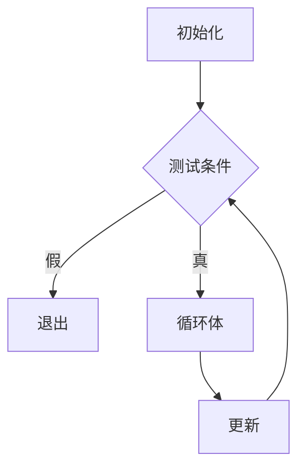
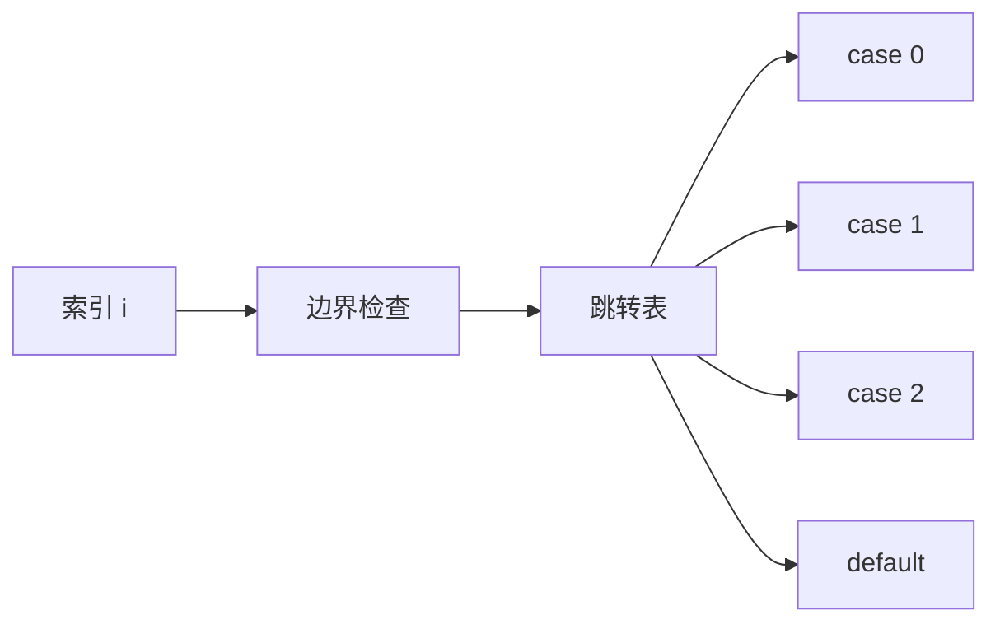
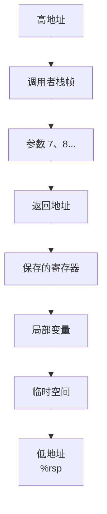
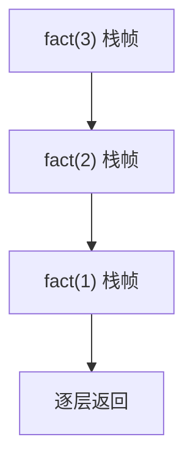
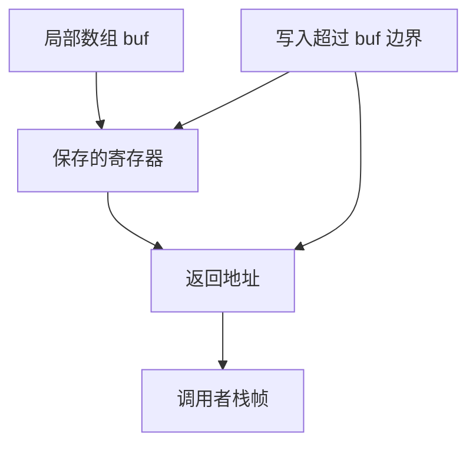
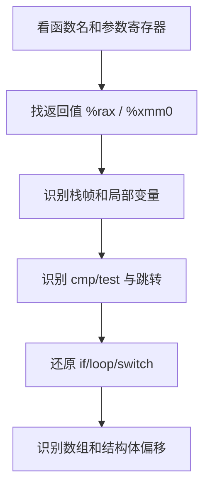
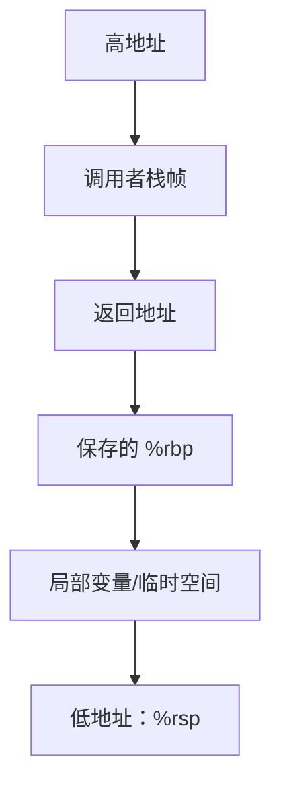
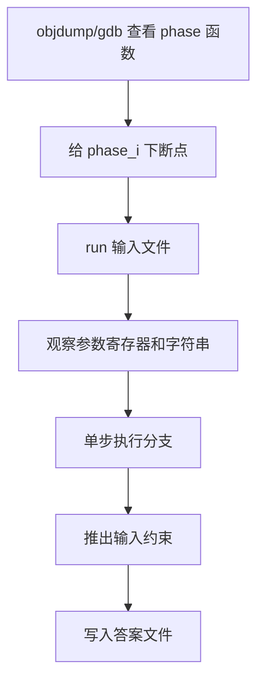

# 第 3 章：程序的机器级表示

> 主题：程序的机器级表示 (Machine-Level Representation of Programs)  
> 目标：能读懂 x86-64 汇编，理解 C 程序如何映射到指令、寄存器、栈、控制流、过程调用和浮点运算。

## 1. 从 C 到机器代码


常用命令：

| 命令 | 作用 |
|---|---|
| `gcc -Og -S a.c` | 生成调试友好的汇编 `.s` |
| `gcc -O1/-O2 -S a.c` | 生成更优化的汇编，可能出现 `cmov` 等指令 |
| `gcc -c a.c` | 生成目标文件 `.o` |
| `objdump -d a.out` | 反汇编可执行文件 |
| `gdb ./a.out` | 调试程序 |

> **注意**：CSAPP 多用 AT&T 汇编语法，操作数顺序是 `源, 目的`，例如 `movq %rax, %rbx` 表示 `%rbx = %rax`。

## 2. x86-64 寄存器速查

| 64 位 | 32 位 | 16 位 | 8 位 | 常见用途 |
|---|---|---|---|---|
| `%rax` | `%eax` | `%ax` | `%al` | 返回值、临时值 |
| `%rbx` | `%ebx` | `%bx` | `%bl` | 被调用者保存 |
| `%rcx` | `%ecx` | `%cx` | `%cl` | 第 4 参数、移位计数 |
| `%rdx` | `%edx` | `%dx` | `%dl` | 第 3 参数、乘除辅助 |
| `%rsi` | `%esi` | `%si` | `%sil` | 第 2 参数 |
| `%rdi` | `%edi` | `%di` | `%dil` | 第 1 参数 |
| `%rbp` | `%ebp` | `%bp` | `%bpl` | 栈帧基址，可被优化掉 |
| `%rsp` | `%esp` | `%sp` | `%spl` | 栈顶指针 |
| `%r8` | `%r8d` | `%r8w` | `%r8b` | 第 5 参数 |
| `%r9` | `%r9d` | `%r9w` | `%r9b` | 第 6 参数 |
| `%r10-%r11` | - | - | - | 调用者保存 |
| `%r12-%r15` | - | - | - | 被调用者保存 |

寄存器保存规则：

| 类型 | 寄存器 | 谁负责恢复 |
|---|---|---|
| 调用者保存 (Caller-Saved) | `%rax`, `%rdi`, `%rsi`, `%rdx`, `%rcx`, `%r8-%r11` | 调用函数前的调用者 |
| 被调用者保存 (Callee-Saved) | `%rbx`, `%rbp`, `%r12-%r15` | 被调用函数 |
| 特殊 | `%rsp` | 始终指向栈顶 |

## 3. 操作数与寻址方式

| 形式 | 含义 | 示例 |
|---|---|---|
| `$Imm` | 立即数 | `$0x10` |
| `Reg` | 寄存器 | `%rax` |
| `Imm` | 绝对地址 | `0x4005d0` |
| `(Reg)` | 内存 `[Reg]` | `(%rax)` |
| `Imm(Reg)` | 内存 `[Reg + Imm]` | `8(%rbp)` |
| `(Rb,Ri)` | 内存 `[Rb + Ri]` | `(%rax,%rdx)` |
| `Imm(Rb,Ri,s)` | 内存 `[Rb + Ri*s + Imm]` | `8(%rbx,%rcx,4)` |

地址计算公式：

```text
地址 = Imm + Rb + Ri * s
s 只能是 1、2、4、8
```

`leaq` 是重点：

| 指令 | 本质 | 常见用途 |
|---|---|---|
| `leaq S, D` | 把地址表达式的值写入 `D` | 地址计算、整数线性表达式计算 |

示例：

```asm
leaq 7(%rdi,%rdi,4), %rax
```

等价于：

```c
rax = 5 * rdi + 7;
```

## 4. 数据传送指令

| 指令 | 含义 |
|---|---|
| `movb/movw/movl/movq` | 传送 1/2/4/8 字节 |
| `movzbl` | 零扩展：小整数转大整数，高位补 0 |
| `movsbl` | 符号扩展：小整数转大整数，高位补符号位 |
| `pushq S` | `rsp -= 8; M[rsp] = S` |
| `popq D` | `D = M[rsp]; rsp += 8` |

> **易错点**：写入 32 位寄存器会自动把对应 64 位寄存器高 32 位清零。  
> 例如 `movl $0, %eax` 会让 `%rax` 变成 0。

## 5. 算术与逻辑操作

| 指令 | C 类比 | 说明 |
|---|---|---|
| `addq S, D` | `D += S` | 加法 |
| `subq S, D` | `D -= S` | 减法 |
| `imulq S, D` | `D *= S` | 有符号乘法 |
| `salq/shlq k, D` | `D <<= k` | 左移 |
| `sarq k, D` | `D >>= k` | 算术右移，保留符号 |
| `shrq k, D` | `D >>= k` | 逻辑右移，高位补 0 |
| `xorq S, D` | `D ^= S` | 常用 `xor %eax,%eax` 清零 |
| `andq S, D` | `D &= S` | 位与 |
| `orq S, D` | `D \|= S` | 位或 |
| `incq D` | `D++` | 不影响 CF |
| `decq D` | `D--` | 不影响 CF |
| `negq D` | `D = -D` | 取负 |
| `notq D` | `D = ~D` | 按位取反 |

移位计数可以是立即数，也可以放在 `%cl` 中。

## 6. 条件码

| 条件码 | 名称 | 含义 |
|---|---|---|
| `CF` | Carry Flag | 无符号溢出/借位 |
| `ZF` | Zero Flag | 结果为 0 |
| `SF` | Sign Flag | 结果为负 |
| `OF` | Overflow Flag | 有符号溢出 |

常见设置方式：

| 指令 | 效果 |
|---|---|
| `cmpq S1, S2` | 计算 `S2 - S1`，只设置条件码 |
| `testq S1, S2` | 计算 `S2 & S1`，只设置条件码 |
| `add/sub/and/xor` | 计算结果并设置条件码 |
| `leaq` | **不设置条件码** |

有符号与无符号比较：

| C 表达式 | 有符号跳转 | 无符号跳转 |
|---|---|---|
| `a == b` | `je` | `je` |
| `a != b` | `jne` | `jne` |
| `a < b` | `jl` | `jb` |
| `a <= b` | `jle` | `jbe` |
| `a > b` | `jg` | `ja` |
| `a >= b` | `jge` | `jae` |

## 7. 控制流

### 7.1 条件跳转



典型 `if-else`：

```c
if (x < y)
    result = y - x;
else
    result = x - y;
```

可能翻译为：

```asm
cmpq %rsi, %rdi
jge  .L2
movq %rsi, %rax
subq %rdi, %rax
ret
.L2:
movq %rdi, %rax
subq %rsi, %rax
ret
```

### 7.2 条件传送

条件传送 (Conditional Move) 用 `cmovXX` 避免分支。

```asm
cmpq  %rsi, %rdi
cmovl %rdx, %rax
```

适合条件：

| 适合 `cmov` | 不适合 `cmov` |
|---|---|
| 两边表达式都很简单 | 分支有副作用 |
| 分支预测困难 | 某个分支计算代价很大 |
| 两边都可以安全执行 | 可能触发异常，如非法内存访问 |

> **注意**：`-Og` 偏向调试友好，常保留跳转；`-O1/-O2` 更容易生成 `cmov`。

### 7.3 循环

循环常被转成 `goto` 风格。



`do-while` 最接近汇编结构，因为先执行循环体，再判断是否回跳。

### 7.4 switch

`switch` 可能使用跳转表 (Jump Table)：



适合跳转表的情况：

| 条件 | 原因 |
|---|---|
| case 值比较密集 | 表大小可控 |
| case 数量较多 | 比连续比较更快 |
| 范围可提前检查 | 防止越界跳转 |

## 8. 过程调用

### 8.1 参数传递

前 6 个整数或指针参数：

| 参数序号 | 寄存器 |
|---|---|
| 1 | `%rdi` |
| 2 | `%rsi` |
| 3 | `%rdx` |
| 4 | `%rcx` |
| 5 | `%r8` |
| 6 | `%r9` |

第 7 个及之后的参数放到栈上。

返回值：

| 返回类型 | 位置 |
|---|---|
| 整数/指针 | `%rax` |
| 浮点数 | `%xmm0` |

### 8.2 栈帧结构



调用流程：

| 指令 | 等价行为 |
|---|---|
| `call label` | 压入返回地址，然后跳转 |
| `ret` | 弹出返回地址，然后跳转 |

> **重点**：栈向低地址增长，`push` 会减小 `%rsp`，`pop` 会增大 `%rsp`。

### 8.3 递归

递归本质是多个栈帧共存：



每一层调用都有自己的局部变量、返回地址和保存寄存器。

## 9. 数组、指针与结构体

### 9.1 数组

C 数组访问：

```c
A[i]
```

地址计算：

```text
&A[i] = A + i * sizeof(A[0])
```

二维数组：

```c
int A[R][C];
```

地址：

```text
&A[i][j] = A + sizeof(int) * (i * C + j)
```

### 9.2 结构体

结构体字段通过固定偏移访问：

```c
struct S {
    int x;
    long y;
};
```

可能布局：

| 字段 | 偏移 | 大小 |
|---|---:|---:|
| `x` | 0 | 4 |
| 填充 | 4 | 4 |
| `y` | 8 | 8 |

> **对齐 (Alignment)** 会插入填充字节，结构体大小通常是最大对齐要求的倍数。

### 9.3 union

联合体 (Union) 的所有字段共享同一段内存。

| 特点 | 说明 |
|---|---|
| 大小 | 等于最大字段大小，外加对齐 |
| 偏移 | 所有字段通常从 0 开始 |
| 风险 | 用错误字段解释数据会产生低层表示相关行为 |

## 10. 浮点代码

现代 x86-64 通常使用 SSE/AVX 指令和 `%xmm` 寄存器处理 `float`、`double`，而不是使用通用寄存器。更早的 x87 浮点栈主要用于兼容旧代码和处理部分 `long double` 场景。

> 本节调用约定以 Linux 上的 System V AMD64 ABI 为准；Windows x64 的参数寄存器分配规则不同。

### 10.1 浮点寄存器与数据格式

XMM 寄存器宽 128 位，YMM 寄存器宽 256 位。标量指令只计算寄存器低位的一个元素，打包指令则并行计算多个元素。

| 后缀 | 数据形式 | XMM 中的有效元素 |
|---|---|---:|
| `ss` | Scalar Single，标量 `float` | 低 32 位的 1 个单精度数 |
| `sd` | Scalar Double，标量 `double` | 低 64 位的 1 个双精度数 |
| `ps` | Packed Single，打包 `float` | 4 个单精度数 |
| `pd` | Packed Double，打包 `double` | 2 个双精度数 |

例如，`addss` 是标量单精度加法，`addsd` 是标量双精度加法，`addps` 和 `addpd` 则执行向量化加法。

### 10.2 数据传送与算术指令

| 指令族 | 作用 |
|---|---|
| `movss` / `movsd` | 传送标量单精度 / 双精度数 |
| `addss` / `addsd` | 浮点加法 |
| `subss` / `subsd` | 浮点减法 |
| `mulss` / `mulsd` | 浮点乘法 |
| `divss` / `divsd` | 浮点除法 |
| `sqrtss` / `sqrtsd` | 浮点平方根 |
| `xorps` / `xorpd` | 按位异或，常用于把 XMM 寄存器清零 |

传统 SSE 指令通常采用两操作数形式，目的寄存器同时也是一个源操作数：

```asm
subsd %xmm1, %xmm0        # xmm0 = xmm0 - xmm1
```

AVX 指令通常在名称前增加 `v`，并使用三操作数形式：

```asm
vsubsd %xmm1, %xmm0, %xmm2   # xmm2 = xmm0 - xmm1
```

> AT&T 语法仍然遵循“源在前、目的在后”。对于 `vsubsd S1, S2, D`，结果是 `D = S2 - S1`，别把两个源操作数看反。

x86 浮点算术指令通常不能直接使用浮点立即数，编译器会把常量放到只读数据区，再通过 RIP 相对寻址加载：

```asm
movsd .LC0(%rip), %xmm0
```

### 10.3 整数与浮点数转换

| 指令族 | 转换方向 |
|---|---|
| `cvtsi2ss` / `cvtsi2sd` | 有符号整数转 `float` / `double` |
| `cvttss2si` / `cvttsd2si` | `float` / `double` 截断后转有符号整数 |
| `cvtss2sd` | `float` 转 `double` |
| `cvtsd2ss` | `double` 转 `float`，可能发生舍入 |

`cvtt` 中的第二个 `t` 表示 **truncate**，即向零截断，与 C 的浮点数转整数规则一致。整数源或目的的宽度还会由具体指令后缀或操作数宽度决定。

> 当浮点值为 NaN、无穷或超出目标整数范围时，不要根据某台机器的转换结果推断可移植的 C 行为；这类转换可能超出语言允许的表示范围。

### 10.4 浮点比较与 NaN

`ucomiss` 和 `ucomisd` 分别比较单精度、双精度浮点数，并设置整数条件码 `ZF`、`PF` 和 `CF`。在 AT&T 语法中，`ucomisd S1, S2` 比较的是 `S2` 与 `S1`。

| 比较结果 | `ZF` | `PF` | `CF` |
|---|---:|---:|---:|
| `S2 > S1` | 0 | 0 | 0 |
| `S2 < S1` | 0 | 0 | 1 |
| `S2 == S1` | 1 | 0 | 0 |
| 无序（至少一个操作数为 NaN） | 1 | 1 | 1 |

浮点比较比整数比较多出“无序”状态，因此编译器必须正确处理 `PF`，或选择能自然排除无序情况的跳转组合：

- 与 NaN 做 `<`、`<=`、`>`、`>=`、`==` 比较均为假。
- 与 NaN 做 `!=` 比较为真。
- 仅根据 `ZF = 1` 判断浮点相等会把 NaN 的无序状态误当成相等。

### 10.5 浮点调用约定

System V AMD64 使用两组相互独立的参数寄存器：整数和指针依次使用 `%rdi` 至 `%r9`，浮点参数依次使用 `%xmm0` 至 `%xmm7`。

| 内容 | 位置 |
|---|---|
| 前 8 个可用的浮点参数 | `%xmm0` 至 `%xmm7` |
| 浮点返回值 | `%xmm0` |
| 超出寄存器容量的参数 | 栈 |
| `%xmm0-%xmm15` | 调用者保存 |

混合参数分别占用各自类别的寄存器。例如：

```c
double f(int i, double x, float y);
```

在 System V AMD64 下，`i` 位于 `%edi`，`x` 位于 `%xmm0`，`y` 位于 `%xmm1`，并不会因为 `i` 是第一个参数就让 `x` 改用 `%xmm1`。

### 10.6 从 C 代码还原浮点汇编

```c
double scaled_delta(double x, double y, int scale)
{
    return (x - y) * (double)scale;
}
```

一种可能的 SSE 汇编是：

```asm
scaled_delta:
    subsd      %xmm1, %xmm0      # x - y
    pxor       %xmm1, %xmm1      # xmm1 清零
    cvtsi2sdl  %edi, %xmm1       # (double) scale
    mulsd      %xmm1, %xmm0      # (x - y) * scale
    ret                            # 结果位于 xmm0
```

读浮点汇编时按以下顺序检查：

1. 根据 `ss`、`sd`、`ps`、`pd` 判断数据类型和标量/向量形式。
2. 查看 `%xmm0-%xmm7`，确定浮点参数及返回值。
3. 遇到 `cvt` 指令时确认转换方向、整数宽度和舍入方式。
4. 遇到 `ucomis` 时同时考虑 NaN 对 `PF` 的影响。
5. 区分 SSE 两操作数和 AVX 三操作数形式，尤其注意减法、除法的源操作数顺序。

GDB 中可查看 XMM 寄存器的不同解释：

```gdb
info registers xmm0 xmm1
p $xmm0.v2_double[0]
p $xmm1.v4_float[0]
info registers mxcsr
```

`MXCSR` 保存 SSE/AVX 浮点运算的舍入模式、异常标志和异常屏蔽位。

## 11. 内存越界与攻击

栈缓冲区溢出：



风险：

| 问题 | 后果 |
|---|---|
| 数组越界写 | 覆盖局部变量、保存寄存器、返回地址 |
| 不检查输入长度 | 栈溢出 |
| 执行栈数据 | 代码注入 |
| 修改返回地址 | 控制流劫持 |

常见防护：

| 机制 | 作用 |
|---|---|
| 栈随机化 (Stack Randomization) | 地址难预测 |
| 栈保护 (Stack Protector) | 检测返回地址附近是否被破坏 |
| 栈不可执行 (NX) | 阻止执行栈上注入代码 |
| 地址空间布局随机化 (ASLR) | 随机化代码/库/栈地址 |

## 12. 读汇编的推荐顺序



速查步骤：

1. 先看函数入口：参数在哪些寄存器。
2. 再看 `%rax` 或 `%xmm0`：整数/指针与浮点返回值如何形成。
3. 遇到 `cmp/test + jXX`：还原条件判断。
4. 遇到 `leaq`：优先当作算术表达式或地址计算。
5. 遇到 `call`：检查调用前的通用参数寄存器和 XMM 参数寄存器。
6. 遇到 `(%rdi,%rax,4)`：联想到数组下标。
7. 遇到固定偏移如 `8(%rdi)`：联想到结构体字段。

## 13. GDB 调试机器级程序

GDB 适合把汇编、寄存器、栈和内存状态连起来看。

### 13.1 编译建议

自己写的小程序建议这样编译：

```bash
gcc -Og -g -fno-omit-frame-pointer -no-pie test.c -o test
```

| 选项 | 作用 |
|---|---|
| `-Og` | 保留较清晰的源代码结构，适合调试 |
| `-g` | 生成调试信息 |
| `-fno-omit-frame-pointer` | 保留 `%rbp` 栈帧指针，方便观察栈帧 |
| `-no-pie` | 关闭位置无关可执行文件，地址更稳定 |

启动：

```bash
gdb -q ./test
```

### 13.2 运行控制

| 命令 | 简写 | 作用 |
|---|---|---|
| `run` | `r` | 启动程序 |
| `run arg1 arg2` | `r arg1 arg2` | 带命令行参数启动 |
| `start` | - | 停在 `main` 开始处 |
| `continue` | `c` | 继续运行到下一个断点 |
| `next` | `n` | 单步执行 C 语句，不进入函数 |
| `step` | `s` | 单步执行 C 语句，进入函数 |
| `nexti` | `ni` | 单步执行一条机器指令，不进入调用 |
| `stepi` | `si` | 单步执行一条机器指令，可进入调用 |
| `finish` | - | 执行到当前函数返回 |
| `quit` | `q` | 退出 GDB |

> 看汇编时优先用 `si` / `ni`，看 C 源码时再用 `s` / `n`。

### 13.3 断点

| 命令 | 作用 |
|---|---|
| `break main` | 在函数入口断点 |
| `break file.c:12` | 在源码行断点 |
| `break *0x401136` | 在机器地址断点 |
| `break *phase_1` | 在函数入口地址断点 |
| `info breakpoints` | 查看断点 |
| `delete 1` | 删除编号为 1 的断点 |
| `disable 1` / `enable 1` | 禁用/启用断点 |
| `condition 1 x == 0` | 给断点 1 加条件 |

Bomb Lab 常用：

```gdb
break main
break phase_1
break explode_bomb
run
```

> 给 `explode_bomb` 下断点，可以在炸弹真正退出前停住，便于回看调用路径。

### 13.4 查看代码与反汇编

| 命令 | 作用 |
|---|---|
| `list` | 查看源码 |
| `disassemble main` | 反汇编函数 |
| `disassemble /r main` | 同时显示机器码字节 |
| `x/10i $pc` | 从当前程序计数器开始显示 10 条指令 |
| `layout asm` | TUI 汇编窗口 |
| `layout regs` | TUI 寄存器窗口 |
| `set disassembly-flavor att` | 使用 AT&T 语法 |
| `set disassembly-flavor intel` | 使用 Intel 语法 |

当前执行位置：

```gdb
x/i $pc
```

`$pc` 在 x86-64 上通常对应 `%rip`。

### 13.5 查看寄存器

| 命令 | 作用 |
|---|---|
| `info registers` | 查看所有通用寄存器 |
| `info registers rax rdi rsi` | 查看指定寄存器 |
| `print/x $rax` | 以十六进制打印 `%rax` |
| `print/d $rax` | 以十进制打印 `%rax` |
| `print/t $rax` | 以二进制打印 `%rax` |
| `set $rax = 0` | 修改寄存器值 |

参数寄存器速查：

| 参数 | 寄存器 |
|---|---|
| 第 1 个 | `%rdi` |
| 第 2 个 | `%rsi` |
| 第 3 个 | `%rdx` |
| 第 4 个 | `%rcx` |
| 第 5 个 | `%r8` |
| 第 6 个 | `%r9` |

整数和指针返回值通常看 `%rax`，浮点返回值通常看 `%xmm0`。

### 13.6 查看内存

`x` 命令格式：

```text
x/NFU 地址
```

含义：

| 字段 | 含义 | 常用值 |
|---|---|---|
| `N` | 显示多少个单元 | `1`, `4`, `16`, `32` |
| `F` | 显示格式 | `x` 十六进制, `d` 十进制, `s` 字符串, `i` 指令 |
| `U` | 单元大小 | `b` 1 字节, `h` 2 字节, `w` 4 字节, `g` 8 字节 |

常用命令：

| 命令 | 作用 |
|---|---|
| `x/16xb $rsp` | 从栈顶看 16 个字节 |
| `x/8gx $rsp` | 从栈顶看 8 个 8 字节值 |
| `x/s $rdi` | 把 `%rdi` 指向的内存当字符串打印 |
| `x/10i $rip` | 从当前指令开始看 10 条指令 |
| `x/wx 0x404040` | 查看地址处 4 字节十六进制值 |

示例：检查函数第一个字符串参数。

```gdb
info registers rdi
x/s $rdi
```

### 13.7 查看栈与调用链

| 命令 | 作用 |
|---|---|
| `backtrace` | 查看调用链 |
| `bt` | `backtrace` 简写 |
| `frame 1` | 切换到调用链第 1 帧 |
| `info frame` | 查看当前栈帧信息 |
| `info args` | 查看当前函数参数 |
| `info locals` | 查看局部变量 |
| `x/8gx $rsp` | 查看栈顶附近内容 |
| `x/8gx $rbp-0x20` | 查看当前栈帧局部区域 |

栈观察重点：



> 栈向低地址增长。`call` 会把返回地址压栈，`ret` 会从栈顶弹出返回地址。

### 13.8 条件码与分支调试

GDB 不直接把 `ZF/SF/OF/CF` 作为普通变量展示，但可以看 `%eflags`。

| 命令 | 作用 |
|---|---|
| `info registers eflags` | 查看条件码寄存器 |
| `x/i $pc` | 查看当前将执行的跳转指令 |
| `si` | 执行一条指令，观察是否跳转 |

调试 `cmp/test + jXX` 的顺序：

1. 停在 `cmp` 或 `test` 前。
2. 查看参与比较的寄存器或内存。
3. 执行 `si`，让条件码被设置。
4. 查看 `eflags`。
5. 再执行 `si`，观察 `jXX` 是否改变 `%rip`。

### 13.9 Bomb Lab 基本流程



推荐启动方式：

```bash
gdb -q ./bomb
```

常用命令：

```gdb
set disassembly-flavor att
break main
break explode_bomb
break phase_1
run answers.txt
```

查看当前 phase 的输入：

```gdb
info registers rdi
x/s $rdi
```

查看比较字符串：

```gdb
x/s 0x402400
```

具体地址要以当前反汇编结果为准。

### 13.10 常用自动显示

`display` 可以让 GDB 每次暂停时自动打印关心的信息。

| 命令 | 作用 |
|---|---|
| `display/i $pc` | 每次停下显示当前指令 |
| `display/x $rax` | 每次停下显示 `%rax` |
| `display/x $rsp` | 每次停下显示栈顶地址 |
| `undisplay 1` | 取消编号为 1 的自动显示 |

适合写入 `tools/gdb/csapp.gdb`：

```gdb
set disassembly-flavor att
set pagination off
display/i $pc
```

使用：

```bash
gdb -q -x tools/gdb/csapp.gdb ./bomb
```

## 14. 常见坑

| 坑 | 正确理解 |
|---|---|
| AT&T 操作数顺序看反 | `movq S, D` 是 `D = S` |
| `cmpq a, b` 看反 | 比较的是 `b - a` |
| 以为 `leaq` 会访存 | `leaq` 只算地址，不读内存 |
| 混淆有符号/无符号跳转 | `jl/jg` 是有符号，`jb/ja` 是无符号 |
| 忘记栈向低地址增长 | `push` 让 `%rsp` 减小 |
| 认为 `-Og` 会充分优化 | `-Og` 偏调试，`-O1/-O2` 才更激进 |
| 忽略 32 位写寄存器清零 | 写 `%eax` 会清空 `%rax` 高 32 位 |
| 混淆 `step` 和 `stepi` | `step` 走 C 语句，`stepi` 走机器指令 |
| 忘记查看参数寄存器 | 函数入口先看 `%rdi/%rsi/%rdx/%rcx/%r8/%r9` |
| 把浮点参数当成整数参数 | System V AMD64 下优先查看 `%xmm0-%xmm7` |
| 混淆 `ss/sd` 与 `ps/pd` | 前者是标量单/双精度，后者是打包单/双精度 |
| 浮点相等只检查 `ZF` | NaN 会产生无序结果，还要排除 `PF = 1` |
| 把 `cvtt` 当作普通舍入 | `cvtt` 表示向零截断 |

## 15. 本章实验关联

| 内容 | 对应练习/实验 |
|---|---|
| 汇编阅读、条件跳转、循环 | `exercises/chapter-03/*.s` |
| 反汇编与控制流恢复 | `labs/bomb-lab` |
| 栈、过程调用、缓冲区溢出 | `labs/attack-lab` |
| SSE/AVX 浮点指令、参数与比较 | `exercises/chapter-03/*.s` |
| GDB 调试机器代码 | `bomb-lab`、`attack-lab` |
