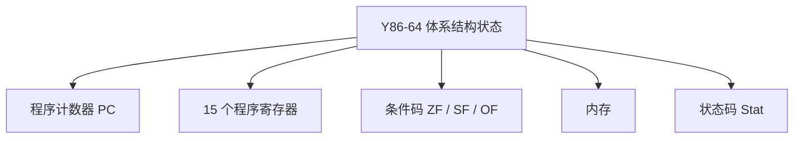
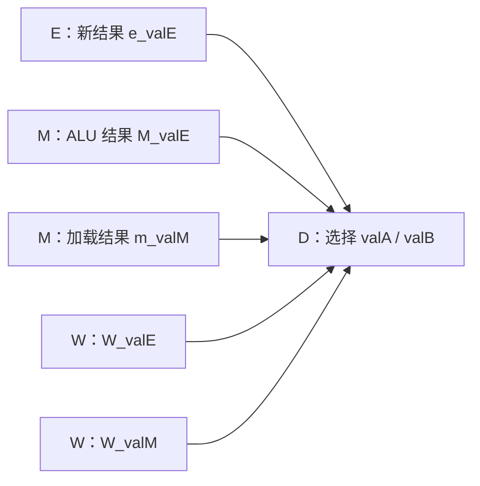
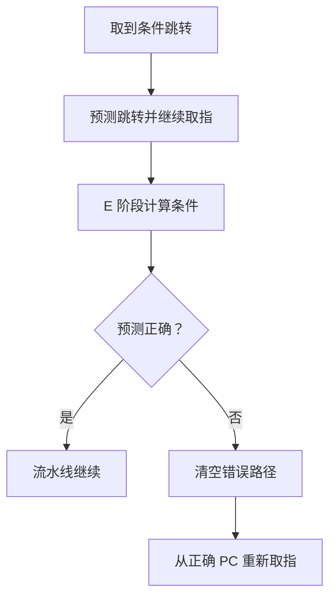
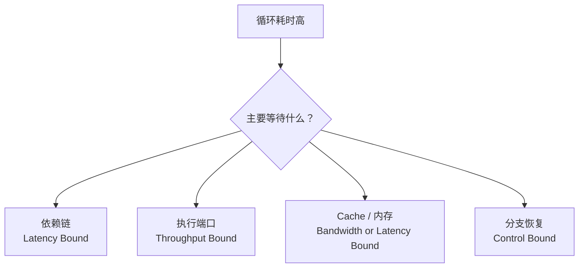

# 第 4 章：处理器体系结构

> 主题：处理器体系结构 (Processor Architecture)  
> 目标：借助 Y86-64 理解指令如何在硬件中执行，重点掌握流水线、冒险处理和性能分析，并把这些概念映射到高性能科学计算软件的优化实践。

## 1. 本章核心视角

第 3 章从软件侧观察机器指令，第 4 章则向下追问：一条指令进入处理器后，数据怎样流动，状态何时更新，多条指令又怎样重叠执行？


对软件方向而言，本章不要求记住每根控制线，而应建立三层联系：

| 层次 | 需要掌握的问题 |
|---|---|
| ISA | 一条指令承诺了什么可见行为？ |
| 微体系结构 | 处理器如何实现这些行为并维持正确性？ |
| 软件性能 | 依赖、分支和访存模式如何影响流水线吞吐？ |

> **重点**：ISA 决定“结果必须是什么”，微体系结构决定“怎样得到结果”。SEQ 和 PIPE 可以实现同一套 Y86-64 ISA，但性能差异很大。

## 2. Y86-64 指令集速览

Y86-64 是为教学简化的 x86-64 子集。它保留寄存器、内存、条件码、跳转和过程调用等核心概念，同时去掉复杂寻址和大量历史兼容设计。

| 指令类别 | 示例 | 作用 |
|---|---|---|
| 数据传送 | `rrmovq`, `irmovq`, `rmmovq`, `mrmovq` | 寄存器、立即数与内存之间传送数据 |
| 整数运算 | `addq`, `subq`, `andq`, `xorq` | 运算并设置条件码 |
| 控制转移 | `jmp`, `jle`, `jl`, `je`, `jne`, `jge`, `jg` | 根据条件码选择下一条指令 |
| 条件传送 | `cmovXX` | 条件成立时写寄存器 |
| 过程调用 | `call`, `ret`, `pushq`, `popq` | 操作栈和控制流 |
| 控制指令 | `halt`, `nop` | 停机或不执行有效工作 |

处理器可见状态包括：



状态码用于表示正常执行、停机、非法指令和非法地址等情况：

| 状态 | 含义 |
|---|---|
| `AOK` | 正常执行 |
| `HLT` | 执行 `halt` |
| `INS` | 非法指令编码 |
| `ADR` | 非法内存地址 |

## 3. 从逻辑电路到 SEQ

组合逻辑根据当前输入立即计算输出，时序逻辑则通过寄存器保存状态。时钟到达时，处理器把本周期算出的下一状态写入状态寄存器。

| 元件 | 作用 |
|---|---|
| 组合逻辑 | ALU、加法器、多路选择器、条件判断 |
| 寄存器 | 保存 PC、流水线中间结果等少量状态 |
| 寄存器文件 | 读取和写入程序寄存器 |
| 随机访问存储器 | 指令存储器与数据存储器 |
| 时钟 | 规定状态更新的边界 |

HCL (Hardware Control Language) 用逻辑表达式描述控制信号。例如，多路选择器本质是在若干候选值中按条件选择一个：

```text
word out = [
    cond_a : value_a;
    cond_b : value_b;
    1      : default_value;
];
```

SEQ 让一条指令在一个时钟周期内走完所有阶段：


SEQ 的优点是控制直观，缺点是时钟周期必须覆盖最慢指令的完整路径。即使当前只是简单的 `nop`，也要等待按最坏情况设计的长时钟周期。

## 4. 为什么需要流水线

流水线把一条长组合逻辑路径切成多个阶段，并在阶段之间加入流水线寄存器。不同指令可以同时占据不同阶段，从而提高单位时间内完成的指令数。


假设一条指令被分为 5 个阶段，理想时序如下：

| 指令 / 周期 | 1 | 2 | 3 | 4 | 5 | 6 | 7 |
|---|---|---|---|---|---|---|---|
| `I1` | F | D | E | M | W |  |  |
| `I2` |  | F | D | E | M | W |  |
| `I3` |  |  | F | D | E | M | W |

流水线改善的是**吞吐率**，不一定缩短单条指令的**延迟**：

| 指标 | 含义 |
|---|---|
| 延迟 (Latency) | 一条指令从进入到完成所需的时间 |
| 吞吐率 (Throughput) | 单位时间内完成的指令数量 |
| CPI | 平均每条指令消耗的时钟周期数 |
| IPC | 平均每周期完成的指令数，单发射流水线中约为 `1 / CPI` |
| CPE | 平均处理一个数据元素所需的周期数，常用于评价循环内核 |

## 5. 流水线性能模型

设流水线有 $k$ 个阶段，第 $i$ 个阶段的组合逻辑延迟为 $\tau_i$，流水线寄存器额外开销为 $d$，则时钟周期近似为：

```text
T_clk = max(τ_i) + d
```

理想情况下，执行 $n$ 条指令需要：

```text
T_total ≈ (k + n - 1) * T_clk
```

当 $n$ 很大且流水线填满后，单发射处理器接近每周期完成一条指令，即 `CPI ≈ 1`。实际 CPI 可粗略理解为：

```text
CPI ≈ 1 + 每条指令平均引入的停顿/气泡数
```

流水线加深并非免费午餐：

| 限制 | 后果 |
|---|---|
| 阶段不均衡 | 时钟仍由最慢阶段决定 |
| 流水线寄存器开销 | 阶段过细后收益递减 |
| 数据依赖 | 后继指令可能必须等待结果 |
| 分支预测失败 | 已取入流水线的错误路径指令被清空 |
| Cache Miss | 后端长时间等待内存数据 |

> 现代 CPU 通常还会采用超标量、乱序执行、寄存器重命名和多级缓存。Y86-64 PIPE 是简化的单发射顺序流水线，但它揭示的依赖和吞吐问题仍然成立。

## 6. PIPE 的五个阶段

### 6.1 Fetch：取指

取指阶段根据当前 PC 读取指令字节，解析 `icode`、`ifun`、寄存器编号和立即数，并计算顺序下一地址 `valP`。

PC 的候选来源包括：

- 预测的顺序地址或分支目标。
- 条件分支预测失败后的正确地址。
- `ret` 从栈中取出的返回地址。

### 6.2 Decode：译码

译码阶段确定源寄存器 `srcA/srcB` 和目的寄存器 `dstE/dstM`，从寄存器文件读取 `valA/valB`。

PIPE 还会在此阶段执行**数据转发**：如果最新结果尚未写回寄存器文件，就直接从后续流水线阶段取得它。

### 6.3 Execute：执行

执行阶段由 ALU 计算算术结果或有效地址，并根据条件码判断条件跳转、条件传送是否成立。

| 指令 | ALU 的典型工作 |
|---|---|
| `OPq` | 计算算术/逻辑结果 |
| `rmmovq/mrmovq` | 计算内存有效地址 |
| `call/pushq` | 栈指针减 8 |
| `ret/popq` | 栈指针加 8 |

### 6.4 Memory：访存

访存阶段根据指令读写数据内存。载入指令直到本阶段末尾才能得到 `valM`，这也是 load/use 冒险无法仅靠普通转发完全消除的原因。

### 6.5 Write Back：写回

写回阶段把 `valE` 或 `valM` 写入目的寄存器。寄存器文件通常允许同一周期先写后读，使写回值能被当前译码阶段看到。

## 7. 数据冒险与转发

当后继指令需要前驱指令尚未写回的结果时，就发生数据冒险。Y86-64 中主要关注 RAW (Read After Write) 真依赖。

```asm
addq %rax, %rbx      # 产生新的 %rbx
subq %rbx, %rcx      # 立即读取 %rbx
```

如果坚持等 `%rbx` 写回寄存器文件，流水线要停多个周期。转发可以把 ALU 结果直接送到需要它的阶段：



译码阶段按“离当前最近、数据最新”的优先级选择转发源，避免读到旧寄存器值。

### 7.1 load/use 冒险

```asm
mrmovq 0(%rdi), %rax
addq   %rax, %rbx
```

`mrmovq` 的数据要到 M 阶段末尾才可用，而下一条 `addq` 下一周期就要进入 E 阶段，因此必须插入一个气泡：

| 周期 | `mrmovq` | `addq` | 处理 |
|---|---|---|---|
| 1 | F |  |  |
| 2 | D | F |  |
| 3 | E | D | 检测到 load/use |
| 4 | M | D | F、D 停顿，E 插入气泡 |
| 5 | W | E | 从 M/W 路径取得加载值 |

> **结论**：转发减少等待，但不能让尚未产生的数据穿越时间。load/use 仍需要至少一次停顿。

### 7.2 stall 与 bubble

| 操作 | 含义 | 典型用途 |
|---|---|---|
| Stall | 保持流水线寄存器原值，不接收新输入 | 等待依赖数据或返回地址 |
| Bubble | 向流水线寄存器写入 `nop` 状态 | 取消错误路径或空出一个执行周期 |

可以把 Stall 理解为“当前指令别动”，把 Bubble 理解为“让这一格变成无副作用的空操作”。

## 8. 控制冒险

### 8.1 条件分支

取指阶段必须先猜下一条 PC，但条件跳转的真实方向要到 E 阶段才能确定。PIPE 通常预测条件跳转会执行，到 E 阶段发现预测错误时：

1. 选择正确的后继 PC。
2. 把错误路径上处于 D、E 附近的年轻指令变成气泡。
3. 从正确路径重新取指。



分支预测失败的代价约等于从取指到解析分支之间的流水线深度。流水线越深，预测错误通常越昂贵。

### 8.2 ret 冒险

`ret` 的下一条 PC 保存在栈中，要到访存阶段才能读出。在返回地址可用前，取指阶段无法确定正确地址，因此需要暂停取指，并向下游插入气泡。

真实处理器使用返回地址栈 (Return Address Stack, RAS) 预测 `ret`，而教学版 PIPE 主要用停顿展示问题本质。

### 8.3 分支对科学计算内核的影响

规则网格内部通常执行相同计算，分支容易预测；边界条件、材料模型切换和接触判断则可能让分支结果随网格单元变化。

常见的软件策略：

- 把内部单元和边界单元拆成不同循环。
- 按单元类型或边界类型预分组，再批量处理。
- 对简单条件尝试条件传送或掩码计算，但先测量再决定。
- 避免为了“无分支”无条件执行昂贵的两侧计算。

## 9. PIPE 控制逻辑速查

控制逻辑必须保证异常情况的优先级一致，不能让同一个流水线寄存器同时 Stall 和 Bubble。

| 情况 | F | D | E | 目的 |
|---|---|---|---|---|
| 正常执行 | Load | Load | Load | 每周期推进 |
| load/use | Stall | Stall | Bubble | 等待加载结果 |
| 分支预测失败 | Load 正确 PC | Bubble | Bubble | 丢弃错误路径 |
| `ret` 尚未取得地址 | Stall | Bubble | Load/Bubble | 阻止继续取错指令 |

简化后的判断思路：

```text
if E 是 load/pop 且 E_dstM 被 D 阶段使用:
    stall F
    stall D
    bubble E

if E 阶段发现条件分支预测错误:
    bubble D
    bubble E

if ret 位于 D/E/M 且返回地址尚不可用:
    stall F
    bubble D
```

> 实际 HCL 还要处理 load/use、分支错误和 `ret` 同时出现时的优先级，不能把上面的伪代码机械翻译成互不相关的 `if`。

## 10. 异常与精确状态

处理器可能遇到非法地址、非法指令和 `halt`。流水线中同时存在多条指令，因此不能在发现异常的瞬间随意停机，否则更老指令可能尚未提交，年轻指令却可能已经修改状态。

PIPE 把状态码随指令一起向后传递，并遵守：

- 异常指令之前的指令允许完成。
- 异常指令及之后的年轻指令不能产生错误的可见状态更新。
- 最终报告与顺序执行模型一致的精确异常位置。

这与现代 CPU 的“按程序顺序提交”思想相通：内部可以并行、预测甚至乱序，但软件看到的体系结构状态仍像按顺序执行。

## 11. 从流水线看软件性能

### 11.1 关键路径与循环依赖

下面的归约循环存在跨迭代依赖：下一次加法必须等待上一次 `sum` 的结果。

```c
double sum_array(const double *a, size_t n)
{
    double sum = 0.0;
    for (size_t i = 0; i < n; i++)
        sum += a[i];
    return sum;
}
```

即使加载和循环控制可以重叠，单一累加器仍形成串行依赖链。展开循环并使用多个累加器，可以提供更多独立工作：

```c
double sum_array_4(const double *a, size_t n)
{
    double s0 = 0.0, s1 = 0.0, s2 = 0.0, s3 = 0.0;
    size_t i = 0;

    for (; i + 3 < n; i += 4)
    {
        s0 += a[i];
        s1 += a[i + 1];
        s2 += a[i + 2];
        s3 += a[i + 3];
    }
    for (; i < n; i++) s0 += a[i];

    return (s0 + s1) + (s2 + s3);
}
```

多个累加器可以提高指令级并行度，也更容易触发 SIMD 向量化，但会改变浮点加法顺序，结果可能有末位差异。

### 11.2 编译器需要看见独立性

| 障碍 | 编译器的顾虑 | 可行做法 |
|---|---|---|
| 指针可能别名 | 写入一个数组可能影响另一个数组 | 在契约真实成立时使用 `restrict` |
| 循环存在跨迭代依赖 | 重排会改变结果 | 重构算法或显式拆分依赖链 |
| 函数调用不可见 | 不知道调用是否有副作用 | 内联小函数或启用 LTO |
| 分支复杂 | 难以向量化和预测 | 分组处理、简化热循环 |
| 数据布局分散 | 连续 SIMD 加载困难 | 在合适场景采用 SoA 布局 |

> `restrict` 是程序员给编译器的承诺，违反承诺会导致未定义行为；它不是“加上就变快”的装饰品。

### 11.3 延迟、吞吐和带宽要分开

一个循环慢，可能是不同瓶颈造成的：



- 依赖链受单次操作延迟限制，增加同类执行单元也未必有用。
- 独立操作很多时，瓶颈可能变成执行端口吞吐率。
- 数据不在 Cache 中时，流水线可能因内存等待而“断粮”。
- 难预测分支会反复清空前端已经完成的工作。

## 12. 面向船海工业仿真的重点

船舶水动力、CFD、有限元和多物理场软件常把大部分时间消耗在少数计算内核中。理解流水线的目的不是手写处理器，而是解释这些内核为何没有达到峰值性能。

| 典型内核 | 流水线视角 | 优化关注点 |
|---|---|---|
| 向量更新、SAXPY 类操作 | 独立迭代多，但常受内存带宽限制 | 连续访问、SIMD、减少不必要读写 |
| 点积与全局归约 | 累加器形成依赖链 | 多累加器、向量归约、并行树形归约 |
| 结构网格 Stencil | 邻域加载多，复用依赖 Cache | 分块、循环顺序、边界与内部拆分 |
| 稀疏矩阵向量乘 | 间接访问导致 Cache Miss | 存储格式、重排序、预取和负载均衡 |
| 通量/Riemann 求解器 | 浮点计算密集且可能有分支 | 内联、SIMD、减少不可预测分支 |
| 非结构网格遍历 | 地址和索引依赖链较长 | 数据布局、重编号、批量处理 |

### 12.1 一个重要判断：算力受限还是访存受限

流水线优化主要提高核心执行效率，但若算法已经受内存带宽限制，单纯减少几条算术指令不会带来明显收益。

实际分析顺序建议：

1. 用剖析工具找到真正的热点函数和循环。
2. 判断瓶颈来自计算、依赖、分支，还是 Cache/内存。
3. 检查数据布局、访问连续性和循环顺序。
4. 查看编译器是否完成内联、循环展开和向量化。
5. 最后再考虑手工 SIMD、预取或更激进的数学变换。

### 12.2 数值正确性优先

科学计算中，允许重排浮点运算的优化可能改变舍入误差、迭代收敛路径和跨平台可复现性。

| 优化 | 可能影响 |
|---|---|
| 多累加器/树形归约 | 改变加法顺序和末位结果 |
| `-ffast-math` | 允许重结合，并弱化 NaN、无穷和有符号零语义 |
| 融合乘加 FMA | 只舍入一次，结果可能与分离乘加不同 |
| SIMD/多线程归约 | 合并顺序可能随实现变化 |

> 对守恒律、残差判据和工程验证敏感的求解器，应先建立误差容限、回归算例和守恒检查，再启用激进优化。跑得快但悄悄改了物理结果，那不是高性能，是高速度制造事故。

### 12.3 与 GPU 和并行计算的联系

CPU 流水线强调指令级并行，GPU 则用大量线程隐藏长延迟；两者结构不同，但软件侧的共通问题包括：

- 依赖链越长，可并行调度的工作越少。
- 分支不规则会降低执行效率。
- 连续、规则的数据访问更容易利用存储系统。
- 需要用足够并行工作隐藏访存和运算延迟。

MPI/OpenMP/CUDA 解决的是更高层次的并行，不能自动消除单个核心或单个线程内部的低效依赖。

## 13. 性能观测工具

### 13.1 编译器报告

```bash
gcc -O3 -march=native -fopt-info-vec-optimized -fopt-info-vec-missed kernel.c
```

| 选项 | 作用 |
|---|---|
| `-O3` | 启用更积极的循环和过程优化 |
| `-march=native` | 针对当前 CPU 启用可用指令集 |
| `-fopt-info-vec-optimized` | 报告成功向量化的位置 |
| `-fopt-info-vec-missed` | 解释未能向量化的原因 |

### 13.2 perf

```bash
perf stat -e cycles,instructions,branches,branch-misses ./solver
```

常用派生指标：

```text
IPC = instructions / cycles
branch-miss-rate = branch-misses / branches
```

解释指标时要结合工作量：

- IPC 低可能表示依赖、Cache Miss 或分支停顿。
- IPC 高不代表算法快，程序可能只是执行了很多无用指令。
- SIMD 指令一次处理多个数据，指令数更少时 IPC 也未必更高。
- 比较优化前后时必须使用相同输入、线程数和数值正确性标准。

### 13.3 反汇编检查

```bash
objdump -d -Mintel ./solver
```

检查热点循环时关注：

1. 是否出现 `xmm/ymm/zmm` 向量指令。
2. 循环中是否仍有函数调用。
3. 是否存在频繁的条件跳转。
4. 加载和存储是否连续、是否重复。
5. 是否存在明显的单一累加器依赖链。

## 14. 常见坑

| 坑 | 正确理解 |
|---|---|
| 认为流水线让单条指令更快 | 流水线主要提高吞吐率，单条指令延迟未必下降 |
| 认为五级流水线一定加速 5 倍 | 阶段不均衡、寄存器开销和冒险都会降低收益 |
| 认为转发能解决所有数据冒险 | load/use 的数据产生得太晚，仍需停顿 |
| 混淆 Stall 和 Bubble | Stall 保持当前状态，Bubble 注入无副作用操作 |
| 认为 `CPI = 1` 是必然 | 分支失败、数据依赖和访存等待都会增加 CPI |
| 只看 IPC 判断程序快慢 | 还要看总周期、工作量、向量宽度和内存瓶颈 |
| 为消除分支计算两边所有结果 | 额外计算可能比分支预测失败更贵 |
| 盲目添加 `restrict` | 别名承诺不成立会导致未定义行为 |
| 对求解器直接启用 `-ffast-math` | 必须先验证收敛性、守恒性和可复现性 |
| 把 PIPE 等同于现代 CPU | PIPE 是教学模型，现代 CPU 还包含乱序、超标量和复杂预测器 |

## 15. 本章实验与复习路线

| 阶段 | 建议任务 | 检查目标 |
|---|---|---|
| ISA | 手工跟踪几条 Y86-64 指令 | 能写出每条指令读写的状态 |
| SEQ | 为一条新指令补充各阶段行为 | 理解数据通路与控制信号 |
| PIPE | 画出依赖指令的时序表 | 能判断转发、Stall 和 Bubble |
| Architecture Lab | 修改 HCL 并运行回归测试 | 保证功能正确并降低 CPE |
| 软件实验 | 对归约/Stencil 做展开与向量化 | 同时比较性能和数值误差 |

Architecture Lab 的典型三部分：

| 部分 | 任务 | 软件侧重点 |
|---|---|---|
| Part A | 编写 Y86-64 程序 | 熟悉 ISA、栈和过程调用 |
| Part B | 在 SEQ 中加入 `iaddq` | 理解一条新指令如何贯穿数据通路与控制逻辑 |
| Part C | 优化 PIPE 上的 `ncopy` | 用循环展开、减少分支和 ISA 扩展降低 CPE |

推荐复习顺序：


本章最终应能回答：

1. 流水线为什么提高吞吐率，却不保证降低单条指令延迟？
2. 数据转发为何有效，load/use 又为何仍需停顿？
3. 分支预测失败和 `ret` 为什么会破坏连续取指？
4. Stall 与 Bubble 分别保持或改变哪些流水线状态？
5. 一个科学计算循环受依赖、分支还是内存限制，应如何用证据区分？
