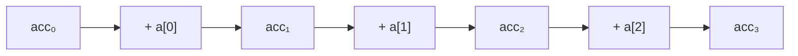
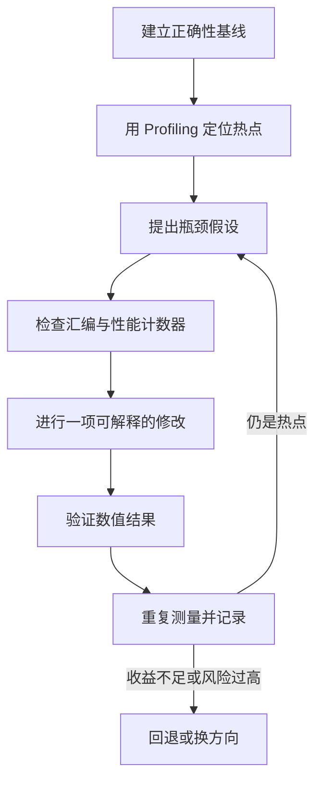

# 第 5 章：优化程序性能

> 主题：优化程序性能 (Optimizing Program Performance)  
> 目标：建立从算法、编译器、处理器到内存系统的性能分析框架，能依据测量结果优化热点循环，并理解优化对数值正确性和可维护性的影响。

## 1. 本章核心视角

高性能程序不是“把代码写得更短”，而是在保持正确性的前提下，减少关键路径上的工作，并让处理器同时完成更多有效操作。


优化时应依次回答：

1. 程序的热点在哪里？
2. 热点受计算、依赖、分支还是访存限制？
3. 编译器为什么没有自动完成预期优化？
4. 修改后是否更快，结果是否仍然正确？

> **重点**：先选择正确算法，再优化热点常数。一个复杂度从 $O(n^2)$ 降为 $O(n \log n)$ 的改进，通常远胜于任何指令级技巧。

## 2. 性能的度量

### 2.1 延迟、吞吐与加速比

| 指标 | 含义 | 适合回答的问题 |
|---|---|---|
| 延迟 (Latency) | 完成一次任务所需时间 | 一次求解要等待多久？ |
| 吞吐率 (Throughput) | 单位时间完成的任务数 | 每秒能处理多少网格或请求？ |
| 加速比 (Speedup) | $S = T_{old}/T_{new}$ | 优化后快了多少倍？ |

加速比必须基于相同输入、相同硬件和相同正确性标准。只比较某段代码的耗时，而忽略初始化、数据传输或迭代次数变化，容易得到虚假的结论。

### 2.2 每元素周期数 CPE

对处理 $n$ 个元素的循环，运行时间常可近似为：

$$
T(n) = C_0 + C_1 n
$$

其中 $C_1$ 就是每元素周期数 (Cycles Per Element, CPE)。当 $n$ 足够大时，固定开销 $C_0$ 的影响减弱，CPE 更适合比较循环内核。

```text
CPE = 总周期数 / 处理的元素数
```

CPE 不是纯粹由源代码行数决定，它还受以下因素影响：

- 运算的数据依赖链；
- 功能单元的延迟与吞吐能力；
- 分支预测是否成功；
- SIMD 向量宽度；
- Cache 命中率与内存带宽。

## 3. 编译器能做什么

编译器在不改变 C/C++ 可观察行为的前提下，可以执行常量传播、公共子表达式消除、死代码删除、函数内联、循环展开和自动向量化等优化。

常见优化等级：

| 选项 | 特点 |
|---|---|
| `-O0` | 基本不优化，便于调试 |
| `-Og` | 保留较好调试体验，同时执行部分优化 |
| `-O2` | 常用发布配置，执行较稳健的优化 |
| `-O3` | 更积极地优化循环、内联和向量化 |
| `-march=native` | 使用本机支持的指令集和调度模型 |
| `-ffast-math` | 放宽浮点语义，可能改变数值结果 |

```bash
gcc -O3 -march=native -S kernel.c -o kernel.s
```

> **注意**：优化等级越高不保证程序越快。代码尺寸膨胀、寄存器压力和不合适的转换都可能抵消收益，最终仍须测量。

## 4. 编译器优化的边界

编译器必须对所有符合语言语义的情况保持正确，因此一些在人看来“显然安全”的变换，它不一定有权执行。

### 4.1 指针别名

两个指针可能指向同一位置，这称为别名 (Aliasing)。

```c
void twiddle(long *xp, long *yp)
{
    *xp += *yp;
    *xp += *yp;
}
```

不能直接把它总是改写为：

```c
void twiddle_opt(long *xp, long *yp)
{
    *xp += 2 * *yp;
}
```

若 `xp == yp`，原程序把值扩大 4 倍，改写后却只扩大 3 倍。编译器不知道调用者是否传入重叠地址，只能采取保守策略。

若程序确实保证对象不重叠，可以在 C 中使用 `restrict` 表达这一承诺：

```c
void saxpy(size_t n, float a,
           const float *restrict x,
           float *restrict y)
{
    for (size_t i = 0; i < n; ++i)
        y[i] += a * x[i];
}
```

`restrict` 有利于向量化，但承诺不成立会产生未定义行为，不能把它当作“强制加速”开关。

### 4.2 函数副作用

函数可能修改全局状态、执行 I/O，或通过指针改变内存，因此编译器不能随意删去、合并或移动函数调用。

```c
for (size_t i = 0; i < vec_length(v); ++i)
    sum += get_vec_element(v, i);
```

若编译器无法证明 `vec_length` 没有副作用，就不能自动把它移出循环。接口设计、内联可见性以及链接时优化都会影响编译器能看见多少信息。

## 5. 消除循环低效操作

### 5.1 循环不变代码外提

循环中不随迭代变化的表达式只需计算一次。

```c
/* 优化前：每轮都调用 strlen，整体可能退化为 O(n^2) */
for (size_t i = 0; i < strlen(s); ++i)
    process(s[i]);

/* 优化后：长度只计算一次，整体为 O(n) */
size_t n = strlen(s);
for (size_t i = 0; i < n; ++i)
    process(s[i]);
```

这类优化称为代码移动 (Code Motion)。除了函数调用，还应注意循环中的地址计算、常量除法和不会变化的边界条件。

### 5.2 减少不必要的函数调用

短小函数经常可以内联，消除调用开销并暴露更多优化机会。不过手工把所有函数展开会破坏抽象；更好的做法通常是让定义对编译器可见，并用性能报告检查是否成功内联。

```bash
gcc -O3 -fopt-info-inline-optimized -fopt-info-inline-missed kernel.c
```

### 5.3 消除不必要的内存引用

下面的写法每轮都可能从内存读取并写回 `*dest`：

```c
void combine(const double *data, size_t n, double *dest)
{
    *dest = 0.0;
    for (size_t i = 0; i < n; ++i)
        *dest += data[i];
}
```

使用局部累加器后，中间结果可以长期保存在寄存器中：

```c
void combine(const double *data, size_t n, double *dest)
{
    double acc = 0.0;
    for (size_t i = 0; i < n; ++i)
        acc += data[i];
    *dest = acc;
}
```

该转换看似简单，但如果 `dest` 可能指向 `data` 内部，两个版本在某些输入下并不等价。这再次说明别名信息为何重要。

## 6. 从处理器流水线理解性能

现代处理器会把指令拆分为多个微操作，分派给不同功能单元，并通过乱序执行同时推进多条彼此独立的指令。


软件侧最需要区分三个概念：

| 概念 | 含义 |
|---|---|
| 操作延迟 | 一次运算的结果多久后可被依赖指令使用 |
| 发射间隔 | 同类操作最短隔多少周期可以开始一次 |
| 功能单元容量 | 处理器拥有多少个可执行该操作的单元 |

精确数值取决于微架构，不应死记。分析时更重要的是判断热点受串行依赖限制，还是受功能单元吞吐限制。

## 7. 数据依赖与关键路径

最朴素的归约只有一个累加器：

```c
double sum(const double *a, size_t n)
{
    double acc = 0.0;
    for (size_t i = 0; i < n; ++i)
        acc += a[i];
    return acc;
}
```

每轮加法依赖上一轮结果，形成一条跨迭代依赖链：



即使处理器每周期能发射多条加法，这条链也难以并行。决定运行时间的是最长依赖链，也就是关键路径 (Critical Path)。

> **关键判断**：增加执行单元只能提升独立操作的吞吐，不能缩短真实依赖本身。

## 8. 循环展开

循环展开 (Loop Unrolling) 一次处理多个元素，可以减少循环索引更新和分支开销，并向编译器暴露更多独立操作。

```c
double sum_unroll2(const double *a, size_t n)
{
    size_t i = 0;
    double acc = 0.0;

    for (; i + 1 < n; i += 2) {
        acc += a[i];
        acc += a[i + 1];
    }
    for (; i < n; ++i)
        acc += a[i];

    return acc;
}
```

展开时必须处理不能整除展开因子的尾部元素。展开因子也不是越大越好：过度展开会增加代码尺寸和寄存器压力，甚至导致寄存器溢出到栈上。

单纯展开仍保留一条 `acc` 依赖链，因此对浮点加法归约的帮助可能有限。

## 9. 多路累积

使用多个累加器可以打断单一依赖链，使多条链在不同功能单元上并行推进。

```c
double sum_acc4(const double *a, size_t n)
{
    size_t i = 0;
    double acc0 = 0.0, acc1 = 0.0;
    double acc2 = 0.0, acc3 = 0.0;

    for (; i + 3 < n; i += 4) {
        acc0 += a[i];
        acc1 += a[i + 1];
        acc2 += a[i + 2];
        acc3 += a[i + 3];
    }

    double acc = (acc0 + acc1) + (acc2 + acc3);
    for (; i < n; ++i)
        acc += a[i];
    return acc;
}
```

假设一次加法延迟为 $L$ 个周期，使用 $k$ 条独立累积链时，依赖造成的理想下界可粗略理解为：

$$
CPE_{dep} \approx \frac{L}{k}
$$

实际性能还受加载吞吐、发射宽度和循环控制限制。当 $k$ 足够大后，瓶颈会转移到其他资源，继续增加累加器不再带来收益。

## 10. 重新结合运算

在数学上，加法和乘法通常满足结合律，但在 C/C++ 的机器运算中需要谨慎。

```c
/* 左结合：一条长依赖链 */
acc = ((acc + a[i]) + a[i + 1]) + a[i + 2];

/* 改变结合顺序：暴露独立操作 */
acc = acc + (a[i] + a[i + 1] + a[i + 2]);
```

对整数而言，需考虑有符号溢出的语言语义；对浮点数而言，舍入使结合律一般不成立：

$$
(a+b)+c \ne a+(b+c)
$$

因此编译器默认不会任意重排浮点归约。`-ffast-math` 会允许更多此类变换，但可能影响误差、NaN、无穷大、守恒性和迭代收敛过程。

## 11. SIMD 与自动向量化

SIMD 指令能让一条指令同时处理多个元素。例如，256 位寄存器理论上可以容纳 4 个 `double` 或 8 个 `float`。

```text
标量：a0+b0  a1+b1  a2+b2  a3+b3
向量：[a0 a1 a2 a3] + [b0 b1 b2 b3]
```

适合向量化的循环通常具有以下特征：

- 迭代之间相互独立；
- 内存连续或访问模式规则；
- 分支少，或分支可转化为掩码；
- 指针不存在未知别名；
- 循环边界清晰且工作量足够大。

```c
void triad(size_t n, double a,
           const double *restrict x,
           const double *restrict y,
           double *restrict z)
{
    for (size_t i = 0; i < n; ++i)
        z[i] = x[i] + a * y[i];
}
```

检查 GCC 的向量化报告：

```bash
gcc -O3 -march=native \
    -fopt-info-vec-optimized \
    -fopt-info-vec-missed kernel.c
```

看到向量指令不等于一定获得理想倍数加速。内存带宽、尾部处理、数据对齐、频率变化和标量剩余循环都会影响结果。

## 12. 分支预测与条件执行

处理器在分支结果确定前就会预测下一条执行路径。预测正确可以保持流水线连续，预测失败则需要丢弃错误路径上的工作。

### 12.1 可预测分支

循环末尾分支通常高度可预测，代价较低。输入无规律的条件分支则可能频繁预测失败：

```c
for (size_t i = 0; i < n; ++i) {
    if (a[i] > 0)
        sum += a[i];
}
```

是否应改为无分支形式取决于数据分布、编译器生成的指令以及两条路径的计算成本。不能仅凭源代码中出现 `if` 就断定它慢。

### 12.2 条件传送与掩码

条件传送或 SIMD 掩码会计算候选结果，再根据条件选择结果，适合两侧计算都很便宜的场景。如果某一路包含昂贵函数、非法访存或除零风险，就不能盲目执行两侧。

> **实践原则**：先用真实数据测量分支失败率，再决定是否改写分支。

## 13. 内存访问对性能的限制

当计算依赖的数据尚未到达寄存器时，功能单元再多也无事可做。应关注加载、存储以及它们之间的依赖。

### 13.1 连续访问与跨步访问

C/C++ 二维数组按行优先存储：

```c
/* 连续访问，通常更友好 */
for (size_t i = 0; i < n; ++i)
    for (size_t j = 0; j < m; ++j)
        sum += a[i][j];

/* 大步长访问，可能浪费 Cache Line */
for (size_t j = 0; j < m; ++j)
    for (size_t i = 0; i < n; ++i)
        sum += a[i][j];
```

连续访问便于硬件预取和 SIMD 加载。更完整的局部性、Cache 和内存层次分析将在第 6 章展开。

### 13.2 写后读依赖

若一次加载读取的地址可能与尚未完成的存储重叠，处理器必须判断能否安全转发数据。地址不明确或访问宽度不匹配时，可能引起停顿。

```c
*p = value;
result = *q;  /* 若 p 与 q 可能重叠，加载不能随意提前 */
```

规则的数据布局与明确的无别名信息，不仅帮助编译器，也有利于硬件调度。

### 13.3 计算受限还是带宽受限

可以用算术强度 (Arithmetic Intensity) 做初步判断：

$$
I = \frac{\text{浮点运算次数}}{\text{从内存传输的字节数}}
$$

- 算术强度低：更可能受内存带宽限制；
- 算术强度高：更可能受计算吞吐限制；
- 数据不能留在 Cache 中时，实际传输量比源代码表面看到的更多。

这是 Roofline 模型的核心视角。它不是本章原书的主要内容，但非常适合分析科学计算内核。

## 14. 面向船海工业仿真的优化重点

船舶水动力、CFD 和结构求解常包含规则网格、稀疏矩阵、Stencil、归约和迭代求解器。不同内核的瓶颈并不相同。

| 内核 | 常见限制 | 优先检查 |
|---|---|---|
| 向量更新、SAXPY | 内存带宽 | 连续访问、融合循环、减少临时数组 |
| 稠密小矩阵计算 | 计算吞吐 | SIMD、寄存器复用、批处理 |
| 稀疏矩阵向量乘 | 不规则访存 | 数据布局、索引开销、分区与局部性 |
| 点积与残差范数 | 归约依赖 | 多路累积、向量化、并行归约 |
| 条件复杂的通量计算 | 分支与计算混合 | 数据分布、预测失败率、掩码成本 |
| 多物理场时间推进 | 内存流量与同步 | 循环融合、减少全局同步、通信计算重叠 |

### 14.1 循环融合

若两个循环遍历相同数据且不存在冲突，可以融合以减少内存往返：

```c
for (size_t i = 0; i < n; ++i)
    tmp[i] = a[i] + b[i];

for (size_t i = 0; i < n; ++i)
    out[i] = scale * tmp[i];
```

可考虑改为：

```c
for (size_t i = 0; i < n; ++i)
    out[i] = scale * (a[i] + b[i]);
```

这样消除了临时数组的写入与再次读取。但融合也可能增加寄存器压力、破坏并行结构，或使单个循环过于复杂，需要通过测量决定。

### 14.2 数据布局

若计算经常分别处理一个结构体数组中的各字段，数组结构 (SoA) 往往比结构体数组 (AoS) 更易向量化：

```c
/* AoS */
struct Cell { double u, v, p; } cells[N];

/* SoA */
struct Field { double u[N], v[N], p[N]; } field;
```

选择布局时还要考虑代码可维护性、访存组合、并行划分和文件格式，不能只追求某一个微基准。

### 14.3 数值正确性与可复现性

归约顺序变化会改变浮点舍入误差。对仿真软件，优化后至少应检查：

1. 守恒量和物理约束是否满足；
2. 残差曲线与迭代次数是否显著变化；
3. 关键场量的误差是否在容许范围内；
4. 不同线程数、向量宽度下是否需要结果可复现；
5. 性能收益是否值得牺牲严格 IEEE 语义。

必要时可使用成对归约、补偿求和或固定归约树，在性能、精度与复现性之间取得平衡。

## 15. 性能测量方法

### 15.1 微基准的基本要求

- 使用发布编译选项并记录完整命令；
- 预热代码和数据，区分冷启动与稳态性能；
- 运行多次并报告中位数或分布，而非只取最快一次；
- 保证优化前后工作量和结果一致；
- 防止编译器删除没有可观察结果的计算；
- 数据规模应覆盖 L1/L2/LLC 和主存等不同区间；
- 记录 CPU、线程绑定、频率策略和系统负载。

### 15.2 计时

较大代码段可使用单调时钟：

```cpp
#include <chrono>

auto begin = std::chrono::steady_clock::now();
kernel();
auto end = std::chrono::steady_clock::now();

double seconds = std::chrono::duration<double>(end - begin).count();
```

单次循环太短时，计时器本身的开销会淹没结果，应批量重复并扣除框架开销。

### 15.3 硬件性能计数器

```bash
perf stat -r 5 \
    -e cycles,instructions,branches,branch-misses,cache-misses \
    ./solver
```

常用派生指标：

```text
IPC = instructions / cycles
分支失败率 = branch-misses / branches
每元素周期数 = cycles / elements
有效带宽 = 实际传输字节数 / time
```

计数器用于支持判断，而不是替代判断。例如 IPC 低可能来自依赖链、Cache Miss、分支失败或前端供给不足，需要结合代码与其他事件继续分析。

### 15.4 性能剖析

```bash
perf record -g ./solver
perf report
```

剖析的首要目标是找到真正热点。若某函数只占总时间的 1%，即使把它完全消除，总加速也不会超过约 1.01 倍。

这就是 Amdahl 定律：

$$
S = \frac{1}{(1-p) + p/s}
$$

其中 $p$ 是可优化部分占原运行时间的比例，$s$ 是该部分自身的加速倍数。

## 16. 一套可复用的优化流程



推荐顺序：

1. 改善算法复杂度和数据结构；
2. 选择合适的编译选项；
3. 消除循环中的无用工作和内存往返；
4. 向编译器表达别名、对齐和迭代独立性；
5. 利用展开、多路累积和 SIMD；
6. 最后才考虑难维护的手写 Intrinsics 或汇编。

每次只做少量可归因的修改，否则性能变化后很难知道真正原因。

## 17. 常见坑

| 坑 | 正确理解 |
|---|---|
| 凭直觉优化整份程序 | 先用 Profiling 找热点 |
| 只看源代码行数判断快慢 | 应检查生成指令、依赖和访存 |
| 认为 `-O3` 自动解决一切 | 别名、浮点语义和复杂控制流会限制优化 |
| 把循环展开当作必然加速 | 还受依赖链、代码尺寸和寄存器压力限制 |
| 累加器越多越好 | 超过硬件吞吐需求后收益消失，还可能溢出到栈 |
| 出现 SIMD 指令就达到峰值 | 仍可能受带宽、尾循环和数据搬运限制 |
| 无条件使用 `restrict` | 错误的无别名承诺会产生未定义行为 |
| 无条件启用 `-ffast-math` | 可能改变精度、异常语义、收敛性和可复现性 |
| 只跑一次微基准 | 噪声、频率和冷启动会使结果失真 |
| 只看 IPC | 总周期、工作量和向量宽度同样重要 |
| 优化非热点代码 | 受 Amdahl 定律限制，整体收益很小 |
| 为性能牺牲所有可读性 | 优化收益应能被测量、测试和维护 |

## 18. 本章实验与复习路线

Performance Lab 的核心任务通常是优化图像处理内核。它不只是练习“循环展开”，而是要求把本章方法连起来：

| 阶段 | 建议任务 | 检查目标 |
|---|---|---|
| 基线 | 测量不同数据规模的 CPE | 区分固定开销和稳态成本 |
| 源码 | 外提循环不变量、减少函数调用 | 消除不必要工作 |
| 依赖 | 画出热点循环的数据依赖图 | 找到关键路径 |
| 流水线 | 展开循环并使用多路累积 | 提高指令级并行性 |
| SIMD | 查看向量化报告和汇编 | 确认编译器实际生成向量代码 |
| 内存 | 改变遍历顺序和数据布局 | 改善局部性与有效带宽 |
| 验证 | 对比输出、误差和边界输入 | 防止用错误换性能 |

推荐复习顺序：


本章最终应能回答：

1. 为什么渐进复杂度相同的两个程序，CPE 可能差距很大？
2. 指针别名和函数副作用为何会限制编译器优化？
3. 循环展开为什么不一定能打破串行依赖链？
4. 多路累积如何在不增加渐进工作量的情况下提高吞吐？
5. 浮点重排为何可能加速归约，又为何会改变数值结果？
6. 如何区分依赖受限、计算吞吐受限和内存带宽受限？
7. 如何用 Profiling、性能计数器和正确性测试构成完整证据链？
